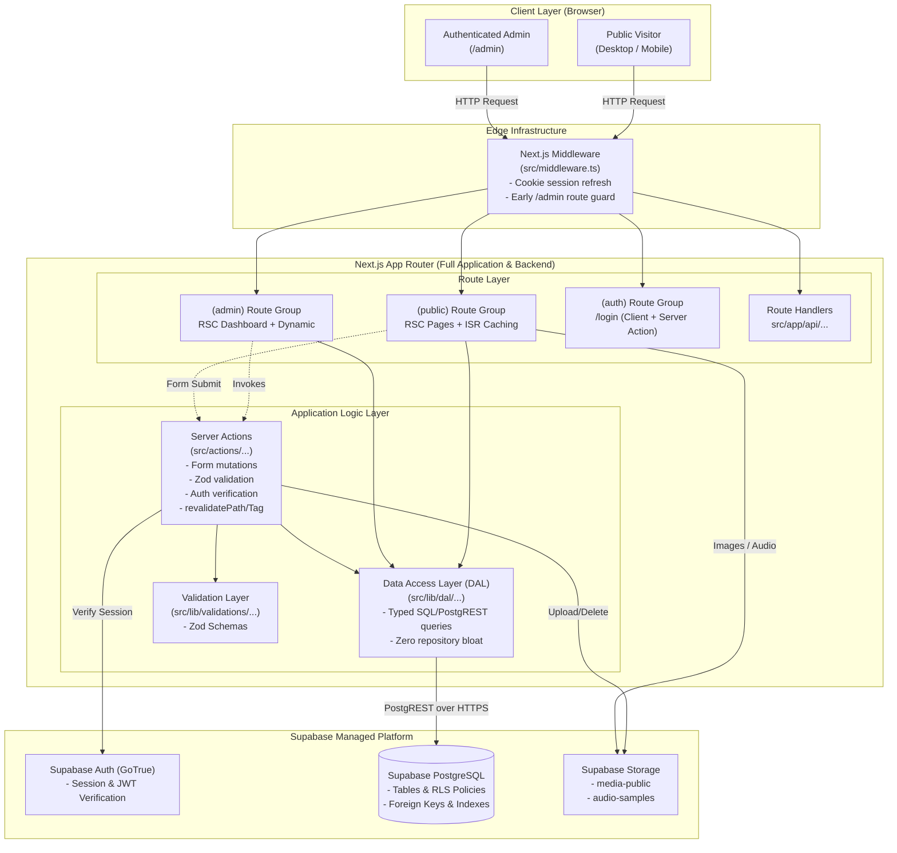
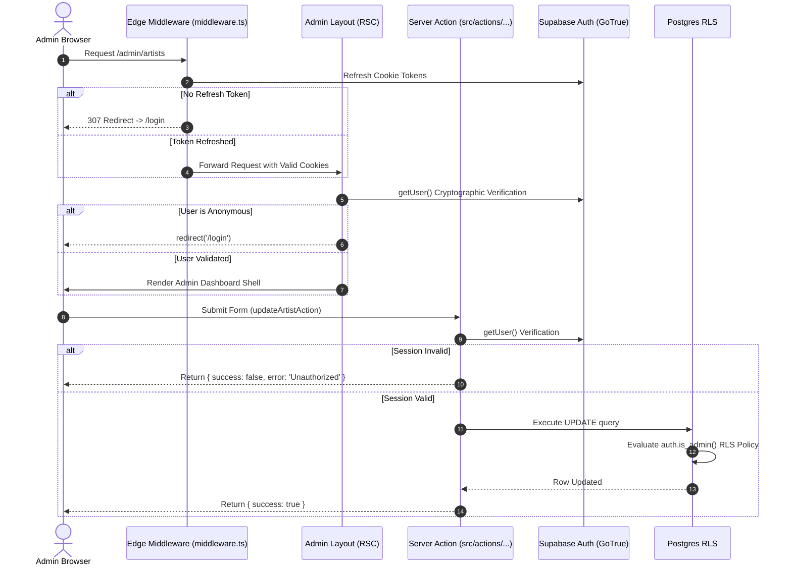
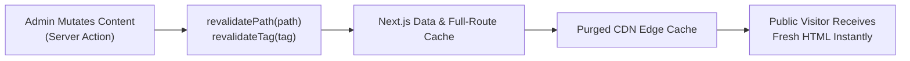

# Andalusia Music Platform — Final Application Architecture

**Target Stack:** Next.js 15+ (App Router), TypeScript, Tailwind CSS v4, Supabase PostgreSQL, Supabase Auth, Supabase Storage.  
**Architecture Model:** Unified Monolithic Web Application (Next.js as UI + Application + Backend Layer).  
**Excluded Technologies:** FastAPI, Express, NestJS, MongoDB, Redis, Microservices, Kubernetes, Docker, separate backend API.  
**Specification References:** [`DATABASE_SCHEMA.md`](file:///home/mahmoud/Desktop/cms/DATABASE_SCHEMA.md), [`AUTH_ARCHITECTURE.md`](file:///home/mahmoud/Desktop/cms/AUTH_ARCHITECTURE.md), [`CMS_SCOPE.md`](file:///home/mahmoud/Desktop/cms/CMS_SCOPE.md), [`CMS_MODULE_MATRIX.md`](file:///home/mahmoud/Desktop/cms/CMS_MODULE_MATRIX.md), [`STATIC_VS_DYNAMIC_REPORT.md`](file:///home/mahmoud/Desktop/cms/STATIC_VS_DYNAMIC_REPORT.md).

---

## 1. System Topology & Architectural Principles

Next.js App Router executes all server-side application logic, database orchestration, authentication guards, and HTML rendering in a single deployable unit.



### 1.1 Core Principles
- **Zero-Backend Separation:** Next.js handles server logic via React Server Components (RSC) and Server Actions; no independent Node/Python microservice is provisioned.
- **No Over-Abstraction:** No generic repository interfaces, unit-of-work abstractions, or multi-tiered dependency injection containers; data access consists of lean, typed async functions calling `@supabase/ssr`.
- **Server by Default:** Every component is an RSC unless browser interactivity (audio player, interactive drawer, sliders, form state) strictly requires `"use client"`.
- **Edge-to-Database Security:** Auth is validated across Middleware, Server Component Layouts, Server Actions, and Postgres Row Level Security (RLS).

---

## 2. Complete Folder Structure

Pragmatic Next.js structure prioritizing domain cohesion, native App Router conventions, and zero redundant nesting.

```text
/home/mahmoud/Desktop/cms/
├── .env.local                          # Environment variables (Supabase URL, Anon Key, Service Role)
├── next.config.ts                      # Image domains, headers, Turbopack config
├── package.json                        # Dependencies and scripts
├── postcss.config.mjs                  # PostCSS plugins
├── tsconfig.json                       # TypeScript compiler paths (@/* -> ./src/*)
├── public/                             # Static static assets
│   ├── assets/
│   │   ├── branding/                   # SVGs: logo, emblem, watermarks
│   │   └── fonts/                      # Local typography fallbacks
│   └── favicon.ico
└── src/
    ├── middleware.ts                   # Session sync & route protection middleware
    ├── app/                            # Next.js App Router root
    │   ├── layout.tsx                  # Root HTML shell (fonts, dir="rtl", Lang="ar")
    │   ├── not-found.tsx               # Global 404 handler
    │   ├── error.tsx                   # Global error boundary
    │   ├── loading.tsx                 # Root suspense fallback
    │   │
    │   ├── (public)/                   # Route group for public portfolio (RTL shell)
    │   │   ├── layout.tsx              # Public shell: Navbar + Footer + RTL wrapper
    │   │   ├── page.tsx                # Home page (/)
    │   │   ├── artists/
    │   │   │   ├── page.tsx            # Artists catalog (/artists)
    │   │   │   └── [slug]/
    │   │   │       └── page.tsx        # Artist detail & discography (/artists/[slug])
    │   │   ├── events/
    │   │   │   ├── page.tsx            # Events catalog (/events)
    │   │   │   └── [slug]/
    │   │   │       └── page.tsx        # Single event details (/events/[slug])
    │   │   ├── academy/
    │   │   │   └── page.tsx            # Educational academy tracks (/academy)
    │   │   ├── news/
    │   │   │   ├── page.tsx            # Cultural stories index (/news)
    │   │   │   └── [slug]/
    │   │   │       └── page.tsx        # Single article view (/news/[slug])
    │   │   └── booking/
    │   │       └── page.tsx            # Inquiry booking form (/booking)
    │   │
    │   ├── (auth)/                     # Dedicated authentication route group
    │   │   └── login/
    │   │       ├── layout.tsx          # Minimal, distraction-free auth shell
    │   │       └── page.tsx            # Admin login screen (/login)
    │   │
    │   ├── (admin)/                    # Private CMS administration workspace
    │   │   └── admin/
    │   │       ├── layout.tsx          # Authenticated admin layout (Sidebar + Header + Breadcrumb)
    │   │       ├── page.tsx            # Dashboard overview & inquiry KPIs (/admin)
    │   │       ├── artists/
    │   │       │   ├── page.tsx        # Artists data table (/admin/artists)
    │   │       │   ├── new/page.tsx    # Create artist form
    │   │       │   └── [id]/page.tsx   # Edit artist form
    │   │       ├── events/
    │   │       │   ├── page.tsx        # Events listing & calendar status (/admin/events)
    │   │       │   ├── new/page.tsx    # Create event form
    │   │       │   └── [id]/page.tsx   # Edit event form
    │   │       ├── tracks/
    │   │       │   └── page.tsx        # Audio tracks manager (/admin/tracks)
    │   │       ├── releases/
    │   │       │   └── page.tsx        # Discography releases manager (/admin/releases)
    │   │       ├── academy/
    │   │       │   └── page.tsx        # Academy course tracks manager (/admin/academy)
    │   │       ├── news/
    │   │       │   ├── page.tsx        # Articles list (/admin/news)
    │   │       │   ├── new/page.tsx    # Article editor (Markdown/Body)
    │   │       │   └── [id]/page.tsx   # Edit article
    │   │       ├── testimonials/
    │   │       │   └── page.tsx        # Testimonials CRUD (/admin/testimonials)
    │   │       ├── bookings/
    │   │       │   ├── page.tsx        # Inquiries CRM inbox (/admin/bookings)
    │   │       │   └── [id]/page.tsx   # Inquiry detail & status triage
    │   │       ├── subscribers/
    │   │       │   └── page.tsx        # Newsletter leads table & CSV export (/admin/subscribers)
    │   │       ├── media/
    │   │       │   └── page.tsx        # Storage media browser (/admin/media)
    │   │       └── settings/
    │   │           └── page.tsx        # Singleton brand/hero/contact settings (/admin/settings)
    │   │
    │   └── api/                        # Route Handlers (strictly necessary integrations only)
    │       ├── auth/
    │       │   └── callback/route.ts   # PKCE auth code exchange
    │       └── revalidate/route.ts     # On-demand webhook cache purging
    │
    ├── actions/                        # Server Actions (Mutations & form handling)
    │   ├── auth.ts                     # Admin login / logout actions
    │   ├── booking.ts                  # Public booking inquiry submission
    │   ├── newsletter.ts               # Public newsletter subscription
    │   ├── artists.ts                  # Admin artists CRUD actions
    │   ├── events.ts                   # Admin events CRUD actions
    │   ├── tracks.ts                   # Admin tracks CRUD & audio link actions
    │   ├── releases.ts                 # Admin releases CRUD actions
    │   ├── academy.ts                  # Admin academy tracks CRUD actions
    │   ├── news.ts                     # Admin news stories CRUD actions
    │   ├── testimonials.ts             # Admin testimonials CRUD actions
    │   ├── settings.ts                 # Admin singleton settings update action
    │   └── media.ts                    # Supabase storage upload & delete actions
    │
    ├── components/                     # Component Library
    │   ├── ui/                         # Atomic, reusable design tokens & components
    │   │   ├── button.tsx              # Primary, outline, ghost, pill variants
    │   │   ├── badge.tsx               # Category & status tags
    │   │   ├── card.tsx                # Content card wrappers
    │   │   ├── input.tsx               # Controlled/uncontrolled input
    │   │   ├── textarea.tsx            # Form text areas
    │   │   ├── select.tsx              # Custom select dropdown
    │   │   ├── dialog.tsx              # Accessible modal dialog
    │   │   ├── table.tsx               # Data table primitives
    │   │   └── toast.tsx               # Feedback notifications
    │   │
    │   ├── public/                     # Public frontend components
    │   │   ├── navbar.tsx              # Floating header (RSC + Client toggle)
    │   │   ├── mobile-nav.tsx          # Client drawer component ("use client")
    │   │   ├── footer.tsx              # Global footer (RSC)
    │   │   ├── hero-section.tsx        # Home hero banner (RSC)
    │   │   ├── events-strip.tsx        # Upcoming concerts carousel/grid (RSC)
    │   │   ├── artist-card.tsx         # Musician grid item (RSC)
    │   │   ├── audio-player.tsx        # Interactive MP3 audio widget ("use client")
    │   │   ├── filter-tabs.tsx         # Category tab switcher ("use client")
    │   │   ├── booking-form.tsx        # Public inquiry form ("use client")
    │   │   ├── testimonial-slider.tsx  # Interactive testimonials slider ("use client")
    │   │   └── newsletter-box.tsx      # Academy newsletter form ("use client")
    │   │
    │   └── admin/                      # Administrative CMS components
    │       ├── sidebar.tsx             # CMS navigation sidebar
    │       ├── topbar.tsx              # Admin user menu & status bar
    │       ├── data-table.tsx          # Reusable sorting/filtering table
    │       ├── status-badge.tsx        # Pending, confirmed, published indicators
    │       ├── file-uploader.tsx       # Media upload widget ("use client")
    │       ├── delete-dialog.tsx       # Confirmation prompt ("use client")
    │       └── submit-button.tsx       # Pending state submit button ("use client")
    │
    ├── lib/                            # Core utilities & singletons
    │   ├── supabase/                   # Supabase clients
    │   │   ├── server.ts               # RSC / Server Action client (cookies)
    │   │   ├── client.ts               # Browser client (for auth state listeners if needed)
    │   │   ├── middleware.ts           # Session refresher for middleware
    │   │   └── admin.ts                # Service role client (strictly for admin seeding/cron)
    │   │
    │   ├── dal/                        # Data Access Layer (PostgREST queries)
    │   │   ├── site-settings.ts        # Singleton settings fetcher
    │   │   ├── artists.ts              # Artists & discography queries
    │   │   ├── events.ts               # Events queries & category filters
    │   │   ├── tracks.ts               # Audio track queries
    │   │   ├── academy.ts              # Learning track queries
    │   │   ├── news.ts                 # Articles & cultural stories queries
    │   │   ├── testimonials.ts         # Testimonials queries
    │   │   └── bookings.ts             # Inquiries triage queries
    │   │
    │   ├── validations/                # Zod Schemas
    │   │   ├── booking.ts              # Public booking inquiry validator
    │   │   ├── newsletter.ts           # Email newsletter validator
    │   │   ├── artist.ts               # Artist create/update schema
    │   │   ├── event.ts                # Event create/update schema
    │   │   ├── track.ts                # Audio track schema
    │   │   ├── article.ts              # News story schema
    │   │   └── settings.ts             # Site settings schema
    │   │
    │   └── utils/                      # Helper functions
    │       ├── formatters.ts           # Arabic date & duration formatters
    │       ├── cn.ts                   # Tailwind class merge utility (clsx + twMerge)
    │       └── errors.ts               # Error response serializer
    │
    └── types/                          # TypeScript definitions
        ├── database.ts                 # Generated Supabase DB types
        └── index.ts                    # Application view models & action responses
```

---

## 3. Route Structure & Segment Map

All routes are grouped logically by accessibility and layout constraints using Next.js Route Groups `(public)`, `(auth)`, and `(admin)`.

| Route Pattern | Layout / Group | Rendering Mode | Auth Guard | Description |
| :--- | :--- | :--- | :--- | :--- |
| `/` | `(public)` | ISR (`revalidate = 3600`) | Public | Home landing: Hero, Events Strip, About, Artists, Testimonials, CTA. |
| `/artists` | `(public)` | ISR (`revalidate = 3600`) | Public | Musicians catalog with client-side category filtering. |
| `/artists/[slug]` | `(public)` | ISR (`generateStaticParams`) | Public | Artist profile: Biography, tracks, discography releases. |
| `/events` | `(public)` | ISR (`revalidate = 1800`) | Public | Concerts & festival listings with category tabs. |
| `/events/[slug]` | `(public)` | ISR (`generateStaticParams`) | Public | Individual concert details, location, and ticket link. |
| `/academy` | `(public)` | Static (`force-static`) | Public | Educational curriculum tracks & newsletter signup. |
| `/news` | `(public)` | ISR (`revalidate = 1800`) | Public | Cultural news, editorial stories, and press releases. |
| `/news/[slug]` | `(public)` | ISR (`generateStaticParams`) | Public | Cultural story reader view. |
| `/booking` | `(public)` | Static shell + Dynamic Action | Public | Booking inquiry form with validation. |
| `/login` | `(auth)` | Dynamic (`force-dynamic`) | Public (Guest) | Administrative credential login screen. Redirects to `/admin` if authenticated. |
| `/admin` | `(admin)` | Dynamic (`force-dynamic`) | Admin Required | Dashboard metrics, recent inquiries, quick status counters. |
| `/admin/artists` | `(admin)` | Dynamic (`force-dynamic`) | Admin Required | Artists listing, display ordering, publish toggle. |
| `/admin/artists/new` | `(admin)` | Dynamic (`force-dynamic`) | Admin Required | Form to add new ensemble musician. |
| `/admin/artists/[id]`| `(admin)` | Dynamic (`force-dynamic`) | Admin Required | Edit musician details, photos, and biographies. |
| `/admin/events` | `(admin)` | Dynamic (`force-dynamic`) | Admin Required | Manage upcoming and past concerts/events. |
| `/admin/tracks` | `(admin)` | Dynamic (`force-dynamic`) | Admin Required | Upload and manage streamable audio MP3 tracks. |
| `/admin/releases` | `(admin)` | Dynamic (`force-dynamic`) | Admin Required | Manage albums, studio recordings, and release years. |
| `/admin/academy` | `(admin)` | Dynamic (`force-dynamic`) | Admin Required | Manage the 3 educational tracks. |
| `/admin/news` | `(admin)` | Dynamic (`force-dynamic`) | Admin Required | Publishing interface for cultural articles. |
| `/admin/testimonials`| `(admin)` | Dynamic (`force-dynamic`) | Admin Required | Manage attendee quotes and client reviews. |
| `/admin/bookings` | `(admin)` | Dynamic (`force-dynamic`) | Admin Required | Inquiries CRM: triage status (`pending`, `contacted`, `confirmed`, `archived`). |
| `/admin/subscribers` | `(admin)` | Dynamic (`force-dynamic`) | Admin Required | View newsletter subscribers, export leads. |
| `/admin/media` | `(admin)` | Dynamic (`force-dynamic`) | Admin Required | Browse and manage assets stored in Supabase buckets. |
| `/admin/settings` | `(admin)` | Dynamic (`force-dynamic`) | Admin Required | Singleton editor for brand copy, hero, phone, email, socials. |
| `/api/auth/callback` | Route Handler | Dynamic | Public | Exchanges auth code for Supabase session cookie. |
| `/api/revalidate` | Route Handler | Dynamic | Secret Token | On-demand cache purge endpoint for external webhooks. |

---

## 4. Server Components (RSC) Strategy

React Server Components execute strictly on the server, producing zero client JavaScript bundle overhead while having direct, fast access to the database layer.

### 4.1 RSC Responsibilities
- Fetch data directly using typed functions in `src/lib/dal/`.
- Render HTML markup for SEO, accessibility, and instant First Contentful Paint (FCP).
- Pass plain serializable props (records, primitives, arrays) down to leaf Client Components.
- Eliminate secret credential leakage; database connection strings and environment keys stay server-side.

### 4.2 RSC Pattern Example (`src/app/(public)/artists/[slug]/page.tsx`)
```tsx
import { notFound } from 'next/navigation';
import Image from 'next/image';
import { getArtistBySlug, getArtistTracks, getArtistReleases } from '@/lib/dal/artists';
import { AudioPlayer } from '@/components/public/audio-player';
import { DiscographyList } from '@/components/public/discography-list';

interface ArtistPageProps {
  params: Promise<{ slug: string }>;
}

export default async function ArtistPage({ params }: ArtistPageProps) {
  const { slug } = await params;
  const [artist, tracks, releases] = await Promise.all([
    getArtistBySlug(slug),
    getArtistTracks(slug),
    getArtistReleases(slug),
  ]);

  if (!artist) {
    notFound();
  }

  return (
    <article className="min-h-screen bg-brand-cream text-brand-espresso py-16 px-4 md:px-8">
      <header className="max-w-5xl mx-auto flex flex-col md:flex-row gap-8 items-center">
        <div className="relative w-64 h-64 md:w-80 md:h-80 rounded-full overflow-hidden border-4 border-brand-primary">
          <Image
            src={artist.portrait_image_url || '/assets/placeholder-artist.jpg'}
            alt={artist.name}
            fill
            className="object-cover"
            priority
          />
        </div>
        <div className="flex-1 space-y-4 text-center md:text-right">
          <span className="text-brand-primary font-mono text-sm tracking-wider uppercase">
            {artist.genre_tag} • {artist.city}
          </span>
          <h1 className="text-4xl md:text-5xl font-bold font-calligraphic text-brand-espresso">
            {artist.name}
          </h1>
          <blockquote className="italic text-lg text-brand-espresso/80 border-r-2 border-brand-primary pr-4">
            "{artist.quote}"
          </blockquote>
          <p className="text-brand-espresso/90 leading-relaxed max-w-2xl">{artist.full_bio}</p>
        </div>
      </header>

      {/* Client Leaf: Interactive Audio Player */}
      {tracks.length > 0 && (
        <section className="max-w-4xl mx-auto mt-16">
          <h2 className="text-2xl font-bold mb-6">استمع إلى التسجيلات الحية</h2>
          <AudioPlayer tracks={tracks} />
        </section>
      )}

      {/* Discography Section */}
      <section className="max-w-4xl mx-auto mt-16">
        <h2 className="text-2xl font-bold mb-6">مسيرتها الفنية والألبومات</h2>
        <DiscographyList releases={releases} />
      </section>
    </article>
  );
}
```

---

## 5. Client Components Boundary Strategy

Client Components are isolated strictly to interactive leaves of the component tree using `"use client"`.

### 5.1 When to Use Client Components
- **Audio Playback:** Managing HTML5 Audio elements, play/pause state, seeking progress bar, and volume controls (`src/components/public/audio-player.tsx`).
- **Interactive Navigation:** Mobile hamburger drawer opening/closing and backdrop clicks (`src/components/public/mobile-nav.tsx`).
- **Filtering Tabs:** Instant client-side tab switching without full server roundtrips (`src/components/public/filter-tabs.tsx`).
- **Form Interactivity:** Tracking pending states via React 19 `useActionState`, handling field validations, and displaying feedback toasts (`src/components/public/booking-form.tsx`).
- **File Upload Widgets:** Drag-and-drop file uploads, progress bars, and direct client-to-storage transfers (`src/components/admin/file-uploader.tsx`).
- **Modals & Dialogs:** Delete confirmation dialogs and interactive slide-over drawers.

### 5.2 Client Component Pattern Example (`src/components/public/booking-form.tsx`)
```tsx
'use client';

import { useActionState } from 'react';
import { submitBookingAction, BookingActionState } from '@/actions/booking';
import { Button } from '@/components/ui/button';

const initialState: BookingActionState = { success: false };

export function BookingForm() {
  const [state, formAction, isPending] = useActionState(submitBookingAction, initialState);

  return (
    <form action={formAction} className="space-y-6 max-w-xl mx-auto bg-white p-8 rounded-2xl shadow-sm border border-brand-surface">
      {state.error && (
        <div className="p-4 bg-red-50 text-red-700 text-sm rounded-lg border border-red-200">
          {state.error}
        </div>
      )}
      {state.success && (
        <div className="p-4 bg-green-50 text-green-700 text-sm rounded-lg border border-green-200">
          تم استلام طلب الحجز بنجاح! سنتواصل معك خلال ٢٤ ساعة لتأكيد التفاصيل.
        </div>
      )}

      <div className="grid grid-cols-1 md:grid-cols-2 gap-4">
        <div>
          <label htmlFor="full_name" className="block text-sm font-medium mb-1">الاسم الكامل *</label>
          <input id="full_name" name="full_name" required className="w-full px-4 py-2 border rounded-lg" />
          {state.fieldErrors?.full_name && (
            <p className="text-red-500 text-xs mt-1">{state.fieldErrors.full_name[0]}</p>
          )}
        </div>
        <div>
          <label htmlFor="phone" className="block text-sm font-medium mb-1">رقم الهاتف *</label>
          <input id="phone" name="phone" type="tel" required dir="ltr" className="w-full px-4 py-2 border rounded-lg text-right" />
          {state.fieldErrors?.phone && (
            <p className="text-red-500 text-xs mt-1">{state.fieldErrors.phone[0]}</p>
          )}
        </div>
      </div>

      <div className="grid grid-cols-1 md:grid-cols-2 gap-4">
        <div>
          <label htmlFor="email" className="block text-sm font-medium mb-1">البريد الإلكتروني *</label>
          <input id="email" name="email" type="email" required dir="ltr" className="w-full px-4 py-2 border rounded-lg text-right" />
        </div>
        <div>
          <label htmlFor="event_type" className="block text-sm font-medium mb-1">نوع الفعالية *</label>
          <select id="event_type" name="event_type" required className="w-full px-4 py-2 border rounded-lg bg-white">
            <option value="concert">حفل موسيقي عام</option>
            <option value="private_event">أمسية أو مناسبة خاصة</option>
            <option value="festival">مهرجان ثقافي</option>
            <option value="workshop">ورشة عمل موسيقية</option>
          </select>
        </div>
      </div>

      <div>
        <label htmlFor="message" className="block text-sm font-medium mb-1">تفاصيل إضافية</label>
        <textarea id="message" name="message" rows={4} className="w-full px-4 py-2 border rounded-lg" />
      </div>

      <Button type="submit" disabled={isPending} className="w-full py-3 bg-brand-primary text-white rounded-full font-bold hover:bg-brand-primary/90 transition-all">
        {isPending ? 'جارٍ الإرسال...' : 'إرسال طلب الحجز ♪'}
      </Button>
    </form>
  );
}
```

---

## 6. Server Actions (Mutation Engine)

All write operations (form submissions, status changes, data creation/updates/deletions) execute via Server Actions with strict validation and authorization boundaries.

### 6.1 Action Architecture & Return Contract
All actions conform to a standard discriminated union return structure:
```typescript
export type ActionResult<T = unknown> =
  | { success: true; data: T; message?: string }
  | { success: false; error: string; fieldErrors?: Record<string, string[]> };
```

### 6.2 Public Action Example (`src/actions/booking.ts`)
```typescript
'use server';

import { createClient } from '@/lib/supabase/server';
import { bookingSchema } from '@/lib/validations/booking';
import { revalidatePath } from 'next/cache';

export interface BookingActionState {
  success: boolean;
  error?: string;
  fieldErrors?: Record<string, string[]>;
}

export async function submitBookingAction(
  _prevState: BookingActionState,
  formData: FormData
): Promise<BookingActionState> {
  // 1. Parse and validate using Zod
  const rawData = Object.fromEntries(formData.entries());
  const validated = bookingSchema.safeParse(rawData);

  if (!validated.success) {
    return {
      success: false,
      error: 'يرجى تصحيح الأخطاء في النموذج.',
      fieldErrors: validated.error.flatten().fieldErrors,
    };
  }

  // 2. Perform Supabase mutation
  const supabase = await createClient();
  const { error } = await supabase.from('booking_requests').insert({
    full_name: validated.data.full_name,
    email: validated.data.email,
    phone: validated.data.phone,
    event_type: validated.data.event_type,
    event_date: validated.data.event_date || null,
    attendee_count: validated.data.attendee_count || null,
    venue_location: validated.data.venue_location || null,
    message: validated.data.message || null,
    status: 'pending',
  });

  if (error) {
    console.error('Booking submission failure:', error.message);
    return { success: false, error: 'حدث خطأ أثناء حفظ طلب الحجز. يرجى المحاولة لاحقاً.' };
  }

  // 3. Revalidate admin bookings list
  revalidatePath('/admin/bookings');

  return { success: true };
}
```

### 6.3 Protected Admin Action Example (`src/actions/artists.ts`)
```typescript
'use server';

import { createClient } from '@/lib/supabase/server';
import { artistSchema } from '@/lib/validations/artist';
import { revalidatePath, revalidateTag } from 'next/cache';
import { ActionResult } from '@/types';

export async function updateArtistAction(
  id: string,
  formData: FormData
): Promise<ActionResult> {
  const supabase = await createClient();

  // 1. Cryptographic Auth Guard
  const { data: { user }, error: authError } = await supabase.auth.getUser();
  if (authError || !user) {
    return { success: false, error: 'غير مصرح لك بتنفيذ هذه العملية.' };
  }

  // 2. Schema Validation
  const rawData = Object.fromEntries(formData.entries());
  const parsed = artistSchema.safeParse(rawData);
  if (!parsed.success) {
    return {
      success: false,
      error: 'بيانات الفنان غير صالحة.',
      fieldErrors: parsed.error.flatten().fieldErrors,
    };
  }

  // 3. Database Execution
  const { error: dbError } = await supabase
    .from('artists')
    .update({
      name: parsed.data.name,
      slug: parsed.data.slug,
      category: parsed.data.category,
      genre_tag: parsed.data.genre_tag,
      city: parsed.data.city,
      quote: parsed.data.quote,
      short_bio: parsed.data.short_bio,
      full_bio: parsed.data.full_bio,
      specialties: parsed.data.specialties,
      portrait_image_url: parsed.data.portrait_image_url,
      is_featured: parsed.data.is_featured,
      is_published: parsed.data.is_published,
      display_order: parsed.data.display_order,
      updated_at: new Date().toISOString(),
    })
    .eq('id', id);

  if (dbError) {
    return { success: false, error: dbError.message };
  }

  // 4. Targeted Cache Invalidation
  revalidatePath('/artists');
  revalidatePath(`/artists/${parsed.data.slug}`);
  revalidatePath('/admin/artists');
  revalidateTag('artists-list');

  return { success: true, data: { id } };
}
```

---

## 7. Route Handlers Strategy

Route Handlers (`src/app/api/.../route.ts`) are restricted exclusively to cases where HTTP protocol semantics or external webhook payloads cannot be handled by Server Actions.

### 7.1 Permitted Route Handlers
1. **Auth Code Exchange (`src/app/api/auth/callback/route.ts`):** Required by Supabase PKCE OAuth / Magic Link redirects to exchange an auth code for a cryptographically secure session cookie.
2. **Cache Purging Webhook (`src/app/api/revalidate/route.ts`):** Secret-bearer token endpoint allowing external webhooks or Supabase Database Webhooks to trigger on-demand cache revalidations.

### 7.2 Prohibited Route Handler Uses
- No internal CRUD endpoints (`GET /api/artists`, `POST /api/events`); RSC directly queries the database and Server Actions handle mutations.
- No REST API wrappers over Supabase PostgREST.

### 7.3 Callback Implementation (`src/app/api/auth/callback/route.ts`)
```typescript
import { NextResponse } from 'next/server';
import { createClient } from '@/lib/supabase/server';

export async function GET(request: Request) {
  const { searchParams, origin } = new URL(request.url);
  const code = searchParams.get('code');
  const next = searchParams.get('next') ?? '/admin';

  if (code) {
    const supabase = await createClient();
    const { error } = await supabase.auth.exchangeCodeForSession(code);
    if (!error) {
      return NextResponse.redirect(`${origin}${next}`);
    }
  }

  return NextResponse.redirect(`${origin}/login?error=auth_exchange_failed`);
}
```

---

## 8. Data Access Layer (DAL)

The Data Access Layer resides in `src/lib/dal/`. It encapsulates raw Supabase PostgREST queries into typed, reusable functions without introducing repository classes or ORM overhead.

### 8.1 DAL Design Rules
- Direct invocation of `createClient()` from `src/lib/supabase/server`.
- Explicit column selection (`select('id, name, slug, ...')`) instead of `select('*')` for performance.
- Direct TypeScript typing via `Database` types generated from the Supabase schema.
- Built-in error logging and predictable `null` / `[]` fallbacks for RSC stability.

### 8.2 DAL Implementation Example (`src/lib/dal/artists.ts`)
```typescript
import { createClient } from '@/lib/supabase/server';
import { Database } from '@/types/database';

export type Artist = Database['public']['Tables']['artists']['Row'];
export type Track = Database['public']['Tables']['tracks']['Row'];
export type Release = Database['public']['Tables']['releases']['Row'];

export async function getPublishedArtists(): Promise<Artist[]> {
  const supabase = await createClient();
  const { data, error } = await supabase
    .from('artists')
    .select('id, name, slug, category, genre_tag, city, quote, short_bio, portrait_image_url, is_featured, display_order')
    .eq('is_published', true)
    .order('display_order', { ascending: true });

  if (error) {
    console.error('DAL Error [getPublishedArtists]:', error.message);
    return [];
  }
  return data || [];
}

export async function getArtistBySlug(slug: string): Promise<Artist | null> {
  const supabase = await createClient();
  const { data, error } = await supabase
    .from('artists')
    .select('*')
    .eq('slug', slug)
    .eq('is_published', true)
    .single();

  if (error) {
    return null;
  }
  return data;
}

export async function getArtistTracks(slug: string): Promise<Track[]> {
  const supabase = await createClient();
  const { data, error } = await supabase
    .from('tracks')
    .select('tracks.*')
    .innerJoin('artists', 'tracks.artist_id', 'artists.id')
    .eq('artists.slug', slug)
    .eq('tracks.is_published', true)
    .order('tracks.display_order', { ascending: true });

  if (error) {
    console.error('DAL Error [getArtistTracks]:', error.message);
    return [];
  }
  return data || [];
}

export async function getArtistReleases(slug: string): Promise<Release[]> {
  const supabase = await createClient();
  const { data, error } = await supabase
    .from('releases')
    .select('releases.*')
    .innerJoin('artists', 'releases.artist_id', 'artists.id')
    .eq('artists.slug', slug)
    .eq('releases.is_published', true)
    .order('releases.release_year', { ascending: false });

  if (error) {
    console.error('DAL Error [getArtistReleases]:', error.message);
    return [];
  }
  return data || [];
}
```

---

## 9. Validation Layer

All data crossing network boundaries (form inputs, route params, JSON payloads) is validated using Zod schemas located in `src/lib/validations/`.

### 9.1 Validation Principles
- Fail fast on the server before database execution.
- Export both the Zod schema and the inferred TypeScript type (`z.infer<typeof schema>`).
- Provide user-friendly Arabic validation messages for all form constraints.

### 9.2 Booking Schema Example (`src/lib/validations/booking.ts`)
```typescript
import { z } from 'zod';

export const bookingSchema = z.object({
  full_name: z
    .string({ required_error: 'الاسم الكامل مطلوب' })
    .min(3, 'الاسم يجب ألا يقل عن ٣ أحرف')
    .max(100, 'الاسم طويل جداً'),
  email: z
    .string({ required_error: 'البريد الإلكتروني مطلوب' })
    .email('صيغة البريد الإلكتروني غير صحيحة'),
  phone: z
    .string({ required_error: 'رقم الهاتف مطلوب' })
    .regex(/^[+0-9\s-]{8,20}$/, 'رقم الهاتف غير صالح'),
  event_type: z.enum(['concert', 'private_event', 'festival', 'workshop'], {
    required_error: 'نوع الفعالية مطلوب',
  }),
  event_date: z.string().optional().nullable(),
  attendee_count: z.coerce.number().int().positive().optional().nullable(),
  venue_location: z.string().max(200).optional().nullable(),
  message: z.string().max(1000, 'الرسالة لا يمكن أن تتجاوز ١٠٠٠ حرف').optional().nullable(),
});

export type BookingInput = z.infer<typeof bookingSchema>;
```

---

## 10. Authentication & Authorization Layer

Authentication relies on Supabase Auth (`@supabase/ssr`) with security enforced across 4 sequential defense layers.



### 10.1 Layer 1: Edge Middleware (`src/middleware.ts`)
```typescript
import { createServerClient } from '@supabase/ssr';
import { NextResponse, type NextRequest } from 'next/server';

export async function middleware(request: NextRequest) {
  let response = NextResponse.next({ request: { headers: request.headers } });

  const supabase = createServerClient(
    process.env.NEXT_PUBLIC_SUPABASE_URL!,
    process.env.NEXT_PUBLIC_SUPABASE_ANON_KEY!,
    {
      cookies: {
        getAll() {
          return request.cookies.getAll();
        },
        setAll(cookiesToSet) {
          cookiesToSet.forEach(({ name, value }) => request.cookies.set(name, value));
          response = NextResponse.next({ request: { headers: request.headers } });
          cookiesToSet.forEach(({ name, value, options }) => response.cookies.set(name, value, options));
        },
      },
    }
  );

  // Refresh auth token
  const { data: { user } } = await supabase.auth.getUser();

  // Guard /admin routes
  if (request.nextUrl.pathname.startsWith('/admin')) {
    if (!user) {
      const loginUrl = new URL('/login', request.url);
      loginUrl.searchParams.set('next', request.nextUrl.pathname);
      return NextResponse.redirect(loginUrl);
    }
  }

  // Redirect authenticated user away from /login
  if (request.nextUrl.pathname === '/login' && user) {
    return NextResponse.redirect(new URL('/admin', request.url));
  }

  return response;
}

export const config = {
  matcher: ['/admin/:path*', '/login'],
};
```

### 10.2 Layer 2: Server Layout Auth Verification (`src/app/(admin)/admin/layout.tsx`)
```tsx
import { redirect } from 'next/navigation';
import { createClient } from '@/lib/supabase/server';
import { AdminSidebar } from '@/components/admin/sidebar';
import { AdminTopbar } from '@/components/admin/topbar';

export default async function AdminLayout({ children }: { children: React.ReactNode }) {
  const supabase = await createClient();
  const { data: { user }, error } = await supabase.auth.getUser();

  if (error || !user) {
    redirect('/login');
  }

  return (
    <div className="min-h-screen flex bg-slate-100 text-slate-900" dir="rtl">
      <AdminSidebar userEmail={user.email!} />
      <div className="flex-1 flex flex-col">
        <AdminTopbar userEmail={user.email!} />
        <main className="p-8 flex-1 overflow-y-auto">{children}</main>
      </div>
    </div>
  );
}
```

### 10.3 Layer 3 & 4: Server Action Guard & Postgres RLS
- Server Actions re-verify identity using `supabase.auth.getUser()` prior to running any SQL mutations.
- The PostgreSQL database enforces RLS policies checking `auth.jwt() ->> 'role' = 'authenticated'`. Direct SQL access by anonymous visitors is permanently blocked.

---

## 11. CMS Layer

The CMS layer provides an administrative back-office tailored strictly to the 9 verified domain modules. No generic page-builder or synthetic block abstractions are permitted.

### 11.1 Module Inventory & Management Mapping
1. **Artists Manager (`/admin/artists`):** Reorder display sequence, edit biographies, toggle published/featured status, upload musician portraits.
2. **Audio & Tracks (`/admin/tracks`):** Assign streamable MP3 files to artists, set track titles and durations.
3. **Releases & Discography (`/admin/releases`):** Associate studio recordings and albums with artists.
4. **Events & Concerts (`/admin/events`):** Schedule concerts, specify ticket links, dates, and locations.
5. **Educational Academy (`/admin/academy`):** Manage the 3 verified tracks (Oud School, Performance Arts, Vocal Arts).
6. **Cultural News & Stories (`/admin/news`):** Editorial articles, excerpts, cover visuals, and author attribution.
7. **Testimonials (`/admin/testimonials`):** Client praise and attendee feedback for the home slider.
8. **Inquiries CRM (`/admin/bookings`):** Triage public leads across states: `pending` -> `contacted` -> `confirmed` -> `archived`.
9. **Site Settings Singleton (`/admin/settings`):** Single-row table (`site_settings`) controlling hero typography, official manifesto, contact phone/email, and social links.

---

## 12. Media Layer (Supabase Storage & Next.js Image)

Media storage is divided between Supabase Storage buckets and Next.js Image optimization.

### 12.1 Storage Buckets Configuration
| Bucket Name | Public Access | Allowed MIME Types | Max Size | Primary Asset Types |
| :--- | :---: | :--- | :--- | :--- |
| `media-public` | **Yes** | `image/jpeg`, `image/png`, `image/webp`, `image/svg+xml` | 5 MB | Artist portraits, concert posters, article covers, brand imagery. |
| `audio-samples`| **Yes** | `audio/mpeg`, `audio/mp3`, `audio/wav` | 25 MB | Audio preview recordings for the interactive artist player. |

### 12.2 Image Optimization Policy (`next.config.ts`)
```typescript
import type { NextConfig } from 'next';

const nextConfig: NextConfig = {
  images: {
    remotePatterns: [
      {
        protocol: 'https',
        hostname: '*.supabase.co',
        pathname: '/storage/v1/object/public/**',
      },
    ],
    formats: ['image/avif', 'image/webp'],
  },
};

export default nextConfig;
```

### 12.3 Storage Server Action (`src/actions/media.ts`)
```typescript
'use server';

import { createClient } from '@/lib/supabase/server';
import { ActionResult } from '@/types';

export async function uploadMediaAction(
  bucket: 'media-public' | 'audio-samples',
  formData: FormData
): Promise<ActionResult<{ url: string }>> {
  const supabase = await createClient();

  // Auth check
  const { data: { user } } = await supabase.auth.getUser();
  if (!user) return { success: false, error: 'غير مصرح' };

  const file = formData.get('file') as File;
  if (!file) return { success: false, error: 'الملف مطلوب' };

  const fileExt = file.name.split('.').pop();
  const fileName = `${Date.now()}-${Math.random().toString(36).substring(2)}.${fileExt}`;
  const filePath = `${fileName}`;

  const { error: uploadError } = await supabase.storage
    .from(bucket)
    .upload(filePath, file, { cacheControl: '31536000', upsert: false });

  if (uploadError) return { success: false, error: uploadError.message };

  const { data: { publicUrl } } = supabase.storage.from(bucket).getPublicUrl(filePath);

  return { success: true, data: { url: publicUrl } };
}
```

---

## 13. Public Layer

The public visitor experience is tailored for maximum performance, RTL typography, and SEO indexing.

### 13.1 RTL-First Layout Architecture (`src/app/layout.tsx`)
- Root layout declares `lang="ar"` and `dir="rtl"`.
- Primary typography: Cairo font for body text, Aref Ruqaa for calligraphic headers, DM Mono for dates and numbers.
- Tailwind CSS logical properties used throughout (`ms-*`, `me-*`, `ps-*`, `pe-*`, `start-*`, `end-*`) to ensure seamless bidirectional alignment.

### 13.2 Metadata & OpenGraph Engine
Every public page exports dynamic or static metadata for search engine indexing:
```typescript
export async function generateMetadata({ params }: { params: Promise<{ slug: string }> }): Promise<Metadata> {
  const { slug } = await params;
  const artist = await getArtistBySlug(slug);
  if (!artist) return { title: 'فنان غير موجود — فرقة أندلسيا' };

  return {
    title: `${artist.name} — فرقة أندلسيا الموسيقية`,
    description: artist.short_bio,
    openGraph: {
      title: artist.name,
      description: artist.quote,
      images: artist.portrait_image_url ? [artist.portrait_image_url] : [],
    },
  };
}
```

---

## 14. Error Handling Strategy

Errors are handled predictably across layout boundaries, Server Actions, and not-found states.

### 14.1 Route Error Boundaries (`src/app/error.tsx`)
- Each major route segment contains an `error.tsx` Client Component catching unhandled render exceptions.
- Displays an accessible Arabic error notice with a retry trigger (`reset()`) and returns zero raw stack traces to visitors.

### 14.2 Not Found Handling (`src/app/not-found.tsx`)
- Triggered whenever `notFound()` is invoked in an RSC (e.g., when an artist or event slug does not exist).
- Renders a styled Arabic 404 page with navigation links back to the home page.

### 14.3 Server Action Error Envelopes
- Server Actions never throw unhandled exceptions to the caller.
- All errors are caught internally and returned as structured payload objects (`{ success: false, error: string }`), ensuring client forms can display granular inline feedback.

---

## 15. Caching & Revalidation Strategy

Hybrid caching pairs Instant Static Generation (SSG/ISR) for public visitors with On-Demand Revalidation on administrative mutations.



### 15.1 Route Caching Profile
| Route | Caching Directive | Revalidation Strategy | Rationale |
| :--- | :--- | :--- | :--- |
| `/` (Home) | `revalidate = 3600` | ISR + On-demand (`revalidatePath('/')`) | Blazing fast TTFB, updated when settings/events change. |
| `/artists` | `revalidate = 3600` | ISR + On-demand (`revalidatePath('/artists')`) | Static catalog; purged on artist mutations. |
| `/artists/[slug]` | `generateStaticParams` | ISR + On-demand | Pre-renders top artist slugs at build time. |
| `/events` | `revalidate = 1800` | ISR + On-demand (`revalidatePath('/events')`) | Updates automatically every 30 mins or on event edit. |
| `/news` | `revalidate = 1800` | ISR + On-demand (`revalidatePath('/news')`) | Semi-static cultural stories feed. |
| `/booking` | `force-static` | Static Shell | Static form shell; submission handled by Server Action. |
| `/admin/**` | `force-dynamic` | None (Always Fresh) | Private dashboard requiring real-time DB state. |

---

## 16. Verification Checklist & Guardrails

- [x] **Monolithic Next.js Stack:** Zero external backend services (FastAPI, Express, NestJS) introduced.
- [x] **Zero Over-Abstraction:** No generic repository interfaces, factories, or redundant abstractions; lean DAL functions calling Supabase client.
- [x] **RSC vs Client Component Isolation:** Only interactive leaves (`AudioPlayer`, `MobileNav`, `BookingForm`, `FilterTabs`) use `"use client"`.
- [x] **End-to-End Security:** Auth enforced via Edge Middleware, RSC Layout `getUser()`, Server Action guards, and Postgres RLS.
- [x] **Native Storage & Image Optimization:** Supabase Storage buckets mapped directly to `next/image` with remote patterns configured.
- [x] **Robust Error & Revalidation Flow:** On-demand cache purging with `revalidatePath` paired with predictable error envelopes.
