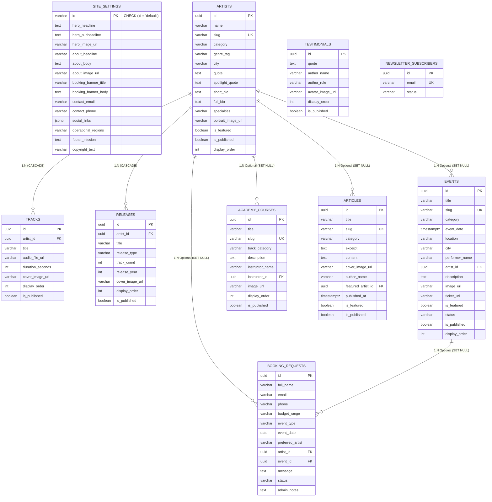

# Andalusia Music Platform — Database Relationships & Referential Integrity

**Specification Reference:** `CONTENT_INVENTORY.md`, `CMS_SCOPE.md`, `DATABASE_SCHEMA.md`  
**Target Engine:** PostgreSQL 15+ (Supabase Managed PostgreSQL)  
**Architectural Principle:** Smallest normalized relational model. Zero speculative join tables. Explicit referential integrity rules.

---

## 1. Relational Entity Diagram (Mermaid ERD)



---

## 2. Cardinality Analysis & Relationship Directory

### 2.1 One-to-One Relationships (1:1)

- **`application` ↔ `site_settings` (1:1 Singleton):**
  - **Cardinality:** Exactly 1 row for the entire application.
  - **Implementation:** Primary key column `id VARCHAR(50) DEFAULT 'default' CHECK (id = 'default')`.
  - **Justification:** Enforces that only one platform configuration row can ever exist. Prevents duplicate site settings while leveraging PostgreSQL relational guarantees.
  - **Cascade / Integrity:** Deletion blocked at database/CMS level.

---

### 2.2 One-to-Many Relationships (1:N)

| Parent Entity | Child Entity | Foreign Key Column | Nullable? | On Delete Action | UI / Architectural Rationale |
| :--- | :--- | :--- | :---: | :--- | :--- |
| **`artists`** | **`tracks`** | `tracks.artist_id` | **NO** | `ON DELETE CASCADE` | Audio player playlist items belong strictly to one musician profile. If an artist profile is deleted, their streamable sample tracks are deleted automatically. |
| **`artists`** | **`releases`** | `releases.artist_id` | **NO** | `ON DELETE CASCADE` | Discography studio and live albums are cataloged strictly under an artist profile. Deleting the artist deletes their discography. |
| **`artists`** | **`events`** | `events.artist_id` | **YES** | `ON DELETE SET NULL` | Live concerts feature ensemble members (e.g. "أحمد العود"), but ensemble concerts or external guest events can exist without linking to an artist ID. If an artist is removed, the event history is preserved with the text `performer_name`. |
| **`artists`** | **`academy_courses`** | `academy_courses.instructor_id` | **YES** | `ON DELETE SET NULL` | Masterclasses may be taught by a featured ensemble musician. If an artist record is removed, the educational course track remains intact with the text `instructor_name`. |
| **`artists`** | **`articles`** | `articles.featured_artist_id` | **YES** | `ON DELETE SET NULL` | Cultural stories frequently spotlight a musician ("حوار مع النحات/الفنان"). If an artist profile is removed, the editorial article remains published. |
| **`artists`** | **`booking_requests`** | `booking_requests.artist_id` | **YES** | `ON DELETE SET NULL` | When a visitor books an engagement from `/artists/[slug]`, the artist ID is captured. If the artist profile is later archived or removed, financial and CRM audit records are strictly preserved with `preferred_artist`. |
| **`events`** | **`booking_requests`** | `booking_requests.event_id` | **YES** | `ON DELETE SET NULL` | When a visitor clicks "احجز" on an event card, the inquiry captures the event ID. If the event passes and is removed, the customer lead record remains intact. |

---

### 2.3 Many-to-Many Relationships (M:N) Evaluation

**VERDICT: ZERO Many-to-Many tables required.**

Every potential M:N candidate was rigorously analyzed and determined to be unnecessary:

1. **`events` ↔ `artists` (No `event_artists` join table):**
   - *Figma Audit Evidence:* Event cards across Home (`87:14400`) and Events (`91:16532`) display a single headline performer string (e.g. "أحمد العود", "يوسف الإيقاع") and an optional single foreign key `artist_id`. There are no multi-band festival lineups or complex stage schedules. Introducing an `event_artists` join table would add 2 unnecessary joins per event card query.
2. **`articles` ↔ `artists` (No `article_artists` join table):**
   - *Figma Audit Evidence:* Articles in Figma spotlight a single topic or interview subject. An optional `featured_artist_id` foreign key completely satisfies this requirement.
3. **`artists` / `events` / `articles` ↔ `taxonomies` (No tag join tables):**
   - *Figma Audit Evidence:* Categories are fixed, small sets of 4–5 values (`category IN ('singing', 'oud', ...)`). Storing them directly on the records with native `CHECK` constraints eliminates 4 taxonomy tables and 4 junction tables (`artist_tags`, `event_tags`, `article_tags`).

---

## 3. Referential Integrity & Foreign Key Constraint Matrix

```sql
-- 1. Tracks parent-child integrity
ALTER TABLE tracks
  ADD CONSTRAINT fk_tracks_artist
  FOREIGN KEY (artist_id)
  REFERENCES artists (id)
  ON DELETE CASCADE;

-- 2. Releases parent-child integrity
ALTER TABLE releases
  ADD CONSTRAINT fk_releases_artist
  FOREIGN KEY (artist_id)
  REFERENCES artists (id)
  ON DELETE CASCADE;

-- 3. Events optional artist reference
ALTER TABLE events
  ADD CONSTRAINT fk_events_artist
  FOREIGN KEY (artist_id)
  REFERENCES artists (id)
  ON DELETE SET NULL;

-- 4. Academy courses optional instructor reference
ALTER TABLE academy_courses
  ADD CONSTRAINT fk_academy_courses_instructor
  FOREIGN KEY (instructor_id)
  REFERENCES artists (id)
  ON DELETE SET NULL;

-- 5. Articles optional spotlight artist reference
ALTER TABLE articles
  ADD CONSTRAINT fk_articles_artist
  FOREIGN KEY (featured_artist_id)
  REFERENCES artists (id)
  ON DELETE SET NULL;

-- 6. Booking requests optional artist reference
ALTER TABLE booking_requests
  ADD CONSTRAINT fk_booking_artist
  FOREIGN KEY (artist_id)
  REFERENCES artists (id)
  ON DELETE SET NULL;

-- 7. Booking requests optional event reference
ALTER TABLE booking_requests
  ADD CONSTRAINT fk_booking_event
  FOREIGN KEY (event_id)
  REFERENCES events (id)
  ON DELETE SET NULL;
```

---

## 4. Query Access Patterns & Indexing Justification

Indexes are strictly designed to support the specific query patterns executed by Next.js Server Components for the verified routes:

### 4.1 Route: `/artists/[slug]`
- **Query 1:** Fetch artist profile by unique slug:
  - *Index:* `artists_slug_key` (`slug`) — Unique $B$-tree index.
- **Query 2:** Fetch active playlist tracks for audio widget:
  - *Index:* `idx_tracks_artist_id` (`artist_id, display_order ASC WHERE is_published = true`). Single-scan index covering filtered playlist items.
- **Query 3:** Fetch active discography releases:
  - *Index:* `idx_releases_artist_id` (`artist_id, release_year DESC, display_order ASC WHERE is_published = true`).

### 4.2 Route: `/artists`
- **Query:** Fetch active directory grid with category filtering and sorting:
  - *Index:* `idx_artists_published_order` (`is_published, display_order ASC, name ASC`).
  - *Index:* `idx_artists_category` (`category WHERE is_published = true`).

### 4.3 Route: `/` (Home Page Strip Queries)
- **Query 1:** Fetch featured artists (limit 4):
  - *Index:* `idx_artists_featured` (`is_featured, display_order ASC WHERE is_featured = true AND is_published = true`).
- **Query 2:** Fetch upcoming events (limit 3):
  - *Index:* `idx_events_date` (`event_date ASC WHERE is_published = true`).
- **Query 3:** Fetch featured cultural articles (limit 3):
  - *Index:* `idx_articles_featured` (`is_featured, published_at DESC WHERE is_featured = true AND is_published = true`).
- **Query 4:** Fetch testimonials slider:
  - *Index:* `idx_testimonials_order` (`display_order ASC WHERE is_published = true`).

### 4.4 Route: `/events`
- **Query 1:** Fetch highlight event banner:
  - *Index:* `idx_events_featured` (`is_featured WHERE is_featured = true AND is_published = true`).
- **Query 2:** Fetch chronological catalog with category filter:
  - *Index:* `idx_events_category_date` (`category, event_date ASC WHERE is_published = true`).

### 4.5 Route: `/news` & `/news/[slug]`
- **Query 1:** Fetch reverse-chronological editorial feed:
  - *Index:* `idx_articles_feed` (`published_at DESC WHERE is_published = true`).
- **Query 2:** Fetch single article by slug:
  - *Index:* `articles_slug_key` (`slug`) — Unique $B$-tree index.

### 4.6 Route: `/booking` & Admin CRM Dashboard
- **Query 1:** Ingest booking request (insert with public write-only RLS).
- **Query 2:** Admin triage pending leads:
  - *Index:* `idx_booking_requests_status_created` (`status, created_at DESC`).
