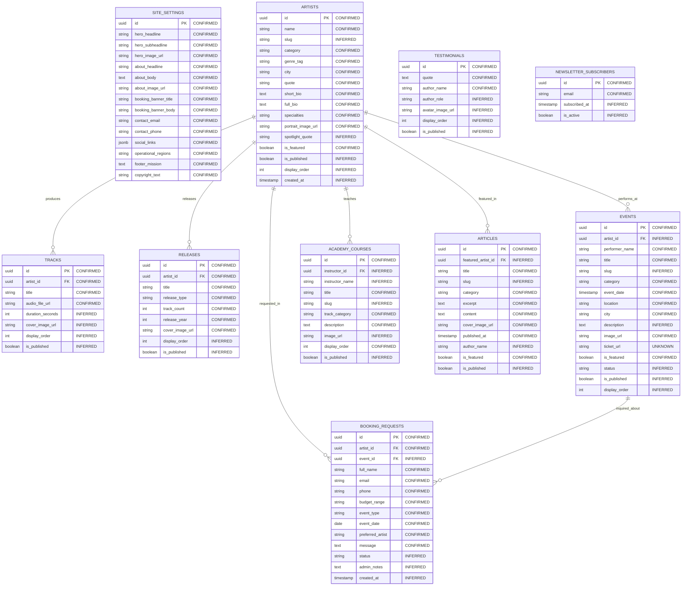

# Andalusia Music Platform — Data Relationship Map

**Specification Reference:** `CONTENT_INVENTORY.md` & `CMS_MODULE_MATRIX.md`  
**Root Node:** `89:15216` (`الرئيسية`)  
**Design Justification Principle:** Only entities and relations directly visible or required by the verified Figma design are introduced. Speculative foreign keys and unnecessary join tables are strictly omitted.

---

## 1. Visual Entity Hierarchy

```text
Site Settings (Singleton: 1 Row) [CONFIRMED]
 ├── Global Navigation & Shell Parameters
 ├── Home Hero & About Manifesto Copy
 └── Operational Hubs & Social Handles

Artists (Core Musician Profile Entity) [CONFIRMED]
 ├── Tracks (1:N — Audio Samples for Player Widget on /artists/[slug]) [CONFIRMED]
 ├── Releases (1:N — Discography Albums on /artists/[slug]) [CONFIRMED]
 ├── Events (1:N Optional — Lead Performer on Concerts/Evenings) [CONFIRMED]
 ├── Articles (1:N Optional — Featured Musician in Cultural Stories) [INFERRED]
 ├── Academy Courses (1:N Optional — Track Instructor) [INFERRED]
 └── Booking Requests (1:N Optional — Requested Artist) [CONFIRMED]

Events (Live Performances Catalog) [CONFIRMED]
 └── Booking Requests (1:N Optional — Inquiries referencing specific Event) [CONFIRMED]

Academy Courses (3 Educational Tracks on /academy) [CONFIRMED]
 └── Booking Requests (1:N Optional — Registration inquiries) [INFERRED]

Articles (Cultural Stories & Press) [CONFIRMED]

Testimonials (Social Proof Quotes on Home Slider) [CONFIRMED]

Booking Requests (User-Submitted Inquiries — Write-Only / Admin CRM) [CONFIRMED]

Newsletter Subscribers (User-Submitted Email Leads from /academy) [CONFIRMED]
```

---

## 2. Mermaid Entity-Relationship Diagram



---

## 3. Relational Foreign Keys & Integrity Constraints

| Parent Entity | Child Entity | Foreign Key Column | Cardinality | Constraint / On Delete Action | Status | Design Justification |
| :--- | :--- | :--- | :---: | :--- | :---: | :--- |
| `artists` | `tracks` | `tracks.artist_id` | 1 : N | `ON DELETE CASCADE` | **CONFIRMED** | Sample tracks loaded into the `/artists/[slug]` audio widget belong strictly to an artist profile. Deleting an artist removes their audio samples. |
| `artists` | `releases` | `releases.artist_id` | 1 : N | `ON DELETE CASCADE` | **CONFIRMED** | Studio and live albums are cataloged per artist under "مسيرتها الفنية". |
| `artists` | `events` | `events.artist_id` | 1 : N (Optional) | `ON DELETE SET NULL` | **INFERRED** | Live events feature ensemble members (e.g. "أحمد العود"), but band-wide or ensemble events can exist without a single musician FK. |
| `artists` | `academy_courses` | `academy_courses.instructor_id` | 1 : N (Optional) | `ON DELETE SET NULL` | **INFERRED** | Masterclasses can be taught by a featured ensemble musician. |
| `artists` | `articles` | `articles.featured_artist_id` | 1 : N (Optional) | `ON DELETE SET NULL` | **INFERRED** | Cultural stories on `/news` often spotlight a band member (e.g. "حوار مع النحات/الفنان"). |
| `artists` | `booking_requests` | `booking_requests.artist_id` | 1 : N (Optional) | `ON DELETE SET NULL` | **CONFIRMED** | When booking from `/artists/[slug]`, the artist is preset. Retaining booking records upon artist deletion preserves business audit history. |
| `events` | `booking_requests` | `booking_requests.event_id` | 1 : N (Optional) | `ON DELETE SET NULL` | **INFERRED** | When booking from an event card, the inquiry captures the target event. |

---

## 4. Complexities Intentionally Avoided (YAGNI)

1. **No Taxonomy / Tag Join Tables:** The categories in Figma ("غناء", "عود", "حفلات", "مهرجانات") are static, small sets of 4–5 values. They are stored directly as enum strings on records, avoiding 4 redundant join tables (`categories`, `tags`, `post_tags`, `event_categories`).
2. **No Multi-Tier Course Hierarchy:** Academy in Figma consists of exactly 3 distinct cards ("ثلاثة مسارات، موهبة واحدة"). No complex `curriculum_modules`, `lessons`, or `enrollments` tables are created.
3. **No Public User Profile Relations:** Booking requests and newsletter signups do not link to a `users` table because visitors submit inquiries as guest leads without accounts.
