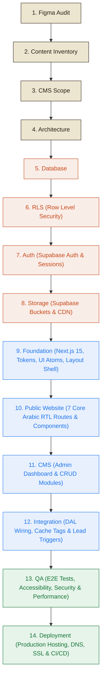
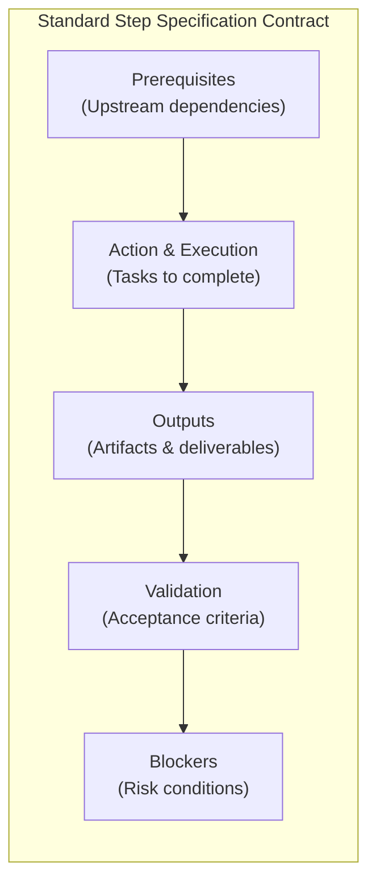
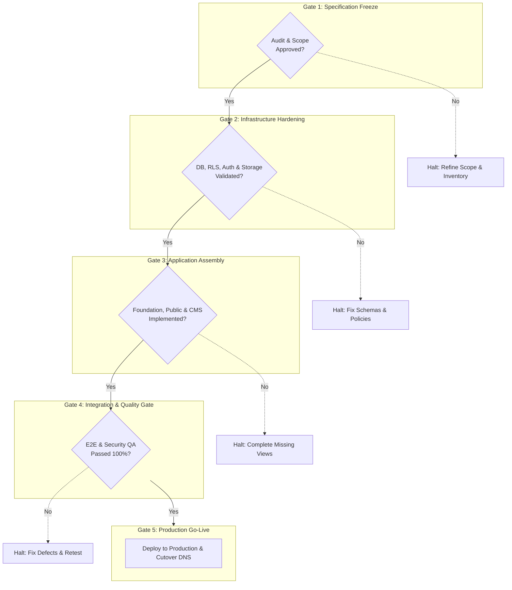

# Andalusia Music Platform — Implementation Dependency Plan

**Specification Status:** Master Execution Sequence  
**Project:** Andalusia Music Band Web Platform (`MahmoudAlmodalal/CMS`)  
**Target Stack:** Next.js 15+ (App Router), TypeScript, Tailwind CSS v4, Supabase (PostgreSQL, Auth, Storage)  
**Execution Rule:** Strict sequential waterfall dependency flow. No downstream step may commence until its upstream prerequisite satisfies all validation gates. **Zero coding permitted during planning phases.**

---

## 1. Master Implementation Sequence Flowchart

---

## 2. Master Implementation Matrix

| Step # | Stage Name | Category | Primary Upstream | Concrete Output | Strict Validation Gate | Primary Blocker |
| :---: | :--- | :--- | :--- | :--- | :--- | :--- |
| **01** | **Figma Audit** | Specification | Figma Source File | Audit Spec & Tokens | 100% canvas & token coverage | Inaccessible design nodes / missing mobile specs |
| **02** | **Content Inventory** | Specification | Step 01 | Content Inventory & Static/Dynamic Map | All visible elements classified | Unresolved content ambiguities / client copy gaps |
| **03** | **CMS Scope** | Specification | Step 02 | CMS Scope Contract & Module Matrix | Zero speculative abstractions | Scope creep (e.g. e-commerce/ticketing/LMS demands) |
| **04** | **Architecture** | Specification | Step 03 | Monolithic App Router System Design | Strict unified stack alignment | Unclear runtime targets or distributed complexity |
| **05** | **Database** | Backend / Infra | Step 04 | PostgreSQL DDL & Migration Scripts | Clean DDL run, FK integrity & explain plans | Missing schema relationships / un-indexed queries |
| **06** | **RLS** | Backend / Infra | Step 05 | RLS Policies & Security Functions | Automated access test matrix passes 100% | Circular policy recursion / security bypasses |
| **07** | **Auth** | Backend / Infra | Step 06 | Supabase Auth SSR & Route Guards | `/admin` blocked, session refresh functional | Cookie domain mismatch / GoTrue token errors |
| **08** | **Storage** | Backend / Infra | Step 07 | Storage Buckets, RLS & CDN Config | Upload/read/MIME restriction tests pass | Missing bucket RLS / CORS blocking audio streaming |
| **09** | **Foundation** | Frontend Core | Steps 01, 04, 07, 08 | Next.js 15 Shell, Tokens, UI Atoms | Zero build errors, clean RTL typography | Hydration mismatch / broken font assets |
| **10** | **Public Website** | Frontend App | Steps 05, 08, 09 | 7 Public Arabic RTL Routes & Audio UI | Visual parity to Figma, responsive (390-1440px) | Missing visual media / mobile overflow bugs |
| **11** | **CMS** | Frontend App | Steps 07, 08, 10 | `/admin` CRUD Dashboard & Media Uploaders | End-to-end create-publish-verify cycle | Upload timeouts on large audio / form validation errors |
| **12** | **Integration** | Full-Stack | Steps 10, 11 | Production DAL, Tag Revalidation, Leads | Zero mock data, instant ISR cache invalidation | Cache tag divergence / SMTP notification failures |
| **13** | **QA** | Quality Gate | Step 12 | E2E Suites, Security & Audit Reports | Core Web Vitals >= 90, 0 high vulnerabilities | iOS audio playback failure / test regressions |
| **14** | **Deployment** | Production | Step 13 | Live Domain, SSL, CI/CD, Monitoring | Zero-downtime deployment, healthy healthcheck | DNS propagation delay / missing production secrets |

---

## 3. Detailed Step-by-Step Specifications

---

### Step 1: Figma Audit
*Establish the visual truth, design system tokens, and UI layout breakdown.*

- **Prerequisites:**
  - Access to authoritative Figma design file: [موقع ويب لفرقة موسيقية](https://www.figma.com/design/xcKbTxQQhUVOFJerTrkrw2/%D9%85%D9%88%D9%82%D8%B9-%D9%88%D9%8A%D8%A8-%D9%84%D9%81%D8%B1%D9%82%D8%A9-%D9%85%D9%88%D8%B3%D9%8A%D9%82%D9%8A%D8%A9?node-id=89-15216).
  - Canvas node permissions for inspect and SVG/PNG asset export.
- **Outputs:**
  - Audit specification: [figma_audit_master_specification.md](file:///home/mahmoud/.gemini/antigravity-cli/brain/91382c33-bfa4-43ae-b64d-e3dabb4df45c/figma_audit_master_specification.md).
  - Design token catalog: Color hex codes (`#C54716`, `#2B1D14`, `#F9F7F0`, `#ECE6D0`, `#F9EDE8`, `#FFD900`), typography font families (`Cairo`, `Aref Ruqaa`, `DM Mono`), spacing scales, and container breakpoints (`390px`, `768px`, `1440px`).
  - Visual component breakdown: Global Navbar, Footer, Hero, Audio Player, Grid Cards, Testimonial Slider, Booking Banner.
- **Validation:**
  - 100% of Figma canvas frames and child nodes cataloged.
  - RTL design requirements and font hierarchies confirmed.
  - Zero unmapped visual styles or arbitrary color variables.
- **Blockers:**
  - Inaccessible Figma file or missing canvas view permissions.
  - Undefined responsive artboards (missing mobile/tablet views).
  - Undefined interaction states (buttons, focus rings, audio scrubber).

---

### Step 2: Content Inventory
*Extract, catalog, and classify every content element into static vs dynamic buckets.*

- **Prerequisites:**
  - Completed and validated Figma Audit ([figma_audit_master_specification.md](file:///home/mahmoud/.gemini/antigravity-cli/brain/91382c33-bfa4-43ae-b64d-e3dabb4df45c/figma_audit_master_specification.md)).
- **Outputs:**
  - Content master document: [`CONTENT_INVENTORY.md`](file:///home/mahmoud/Desktop/cms/CONTENT_INVENTORY.md).
  - Static vs dynamic decision record: [`STATIC_VS_DYNAMIC_REPORT.md`](file:///home/mahmoud/Desktop/cms/STATIC_VS_DYNAMIC_REPORT.md).
  - Open content questions ledger: [`CONTENT_OPEN_QUESTIONS.md`](file:///home/mahmoud/Desktop/cms/CONTENT_OPEN_QUESTIONS.md).
- **Validation:**
  - Every text element, headline, badge, and image from Figma mapped to a specific page section.
  - Binary classification: Fixed code asset (static) vs PostgreSQL entity (dynamic).
  - Verification that static UI elements (nav labels, brand mark) do not pollute the database.
- **Blockers:**
  - Unresolved client questions on content models (e.g. ticketing logic vs contact leads).
  - Missing text copy or placeholder lorem ipsum in critical brand sections.
  - Ambiguity surrounding multi-language fallbacks.

---

### Step 3: CMS Scope
*Define the exact boundaries of the content management system to eliminate speculative over-engineering.*

- **Prerequisites:**
  - Verified Content Inventory ([`CONTENT_INVENTORY.md`](file:///home/mahmoud/Desktop/cms/CONTENT_INVENTORY.md)).
  - Completed Static vs Dynamic Report ([`STATIC_VS_DYNAMIC_REPORT.md`](file:///home/mahmoud/Desktop/cms/STATIC_VS_DYNAMIC_REPORT.md)).
- **Outputs:**
  - Formal CMS scope document: [`CMS_SCOPE.md`](file:///home/mahmoud/Desktop/cms/CMS_SCOPE.md).
  - Module justification matrix: [`CMS_MODULE_MATRIX.md`](file:///home/mahmoud/Desktop/cms/CMS_MODULE_MATRIX.md).
  - Confirmed 8 content modules: Site Settings (singleton), Artists, Tracks, Events, Academy, News, Testimonials, CRM Leads.
  - Explicit out-of-scope declarations (no Stripe gateway, no LMS student portal, no multi-tenant RBAC).
- **Validation:**
  - Strict 1:1 parity between CMS module fields and public website presentation needs.
  - Rejection of generic block builders or speculative entity relationships.
  - Client sign-off on functional scope limits.
- **Blockers:**
  - Stakeholder requests for speculative features (e-commerce ticketing, full learning management).
  - Unclear editorial workflow requirements (draft vs immediate publish).

---

### Step 4: Architecture
*Design the unified application runtime, data flow, directory layout, and caching topology.*

- **Prerequisites:**
  - Approved CMS Scope ([`CMS_SCOPE.md`](file:///home/mahmoud/Desktop/cms/CMS_SCOPE.md)).
  - Non-functional performance and security targets established.
- **Outputs:**
  - System architecture specification: [`APPLICATION_ARCHITECTURE.md`](file:///home/mahmoud/Desktop/cms/APPLICATION_ARCHITECTURE.md).
  - Defined system topology: Monolithic Next.js 15 App Router + Supabase Managed Platform.
  - Defined directory structure: `src/app/(public)`, `src/app/(admin)`, `src/app/(auth)`, `src/lib/dal`, `src/actions`.
  - Caching and revalidation blueprint: ISR with tag-based on-demand invalidation (`revalidateTag`).
- **Validation:**
  - Zero external microservices or redundant backend runtimes (no FastAPI, no Express).
  - Data Access Layer (DAL) patterns isolate raw database queries from RSC rendering.
  - Server Actions handle all mutations with strict Zod schema validation.
- **Blockers:**
  - Hosting environment incompatible with Next.js 15 Node.js / Edge runtime features.
  - Ambiguous separation between server and client state boundaries.

---

### Step 5: Database
*Author and verify normalized relational database schemas, indexes, and triggers.*

- **Prerequisites:**
  - System Architecture specification ([`APPLICATION_ARCHITECTURE.md`](file:///home/mahmoud/Desktop/cms/APPLICATION_ARCHITECTURE.md)).
  - CMS Scope field specifications ([`CMS_SCOPE.md`](file:///home/mahmoud/Desktop/cms/CMS_SCOPE.md)).
- **Outputs:**
  - Complete SQL DDL migrations: [`DATABASE_SCHEMA.md`](file:///home/mahmoud/Desktop/cms/DATABASE_SCHEMA.md).
  - Entity-relationship diagrams & integrity rules: [`DATABASE_RELATIONSHIPS.md`](file:///home/mahmoud/Desktop/cms/DATABASE_RELATIONSHIPS.md), [`DATA_RELATIONSHIP_MAP.md`](file:///home/mahmoud/Desktop/cms/DATA_RELATIONSHIP_MAP.md).
  - 10 normalized tables: `site_settings`, `artists`, `tracks`, `releases`, `events`, `academy_courses`, `articles`, `testimonials`, `booking_requests`, `newsletter_subscribers`.
  - Performance indexes (B-Tree on `slug`, `is_published`, `published_at`, `event_date`).
  - Automated `updated_at` trigger functions and search vector generators.
- **Validation:**
  - Migration script executes without errors on clean PostgreSQL 15+ instance.
  - Foreign key constraints prevent orphaned records (`ON DELETE CASCADE` or `RESTRICT`).
  - `EXPLAIN ANALYZE` confirms index scans on all high-traffic public query filters.
- **Blockers:**
  - Unresolved schema relationships or circular foreign key dependencies.
  - Lack of database provisioning credentials or PostgreSQL instance availability.

---

### Step 6: RLS (Row Level Security)
*Implement zero-trust row-level security policies enforcing default deny across all entities.*

- **Prerequisites:**
  - Executed and validated Database Schema ([`DATABASE_SCHEMA.md`](file:///home/mahmoud/Desktop/cms/DATABASE_SCHEMA.md)).
  - Security model specification ([`SECURITY_MODEL.md`](file:///home/mahmoud/Desktop/cms/SECURITY_MODEL.md)).
- **Outputs:**
  - SQL RLS migration script: [`RLS_DESIGN.md`](file:///home/mahmoud/Desktop/cms/RLS_DESIGN.md).
  - Enforcement of `FORCE ROW LEVEL SECURITY` across all 10 application tables.
  - Implementation of security helper functions: `auth.is_admin()`.
  - Public read policies: restricted strictly to `is_published = true` (and `published_at <= now()` for articles).
  - CRM lead table isolation: `anon` role blocked from `SELECT`/`UPDATE`/`DELETE` on `booking_requests`.
- **Validation:**
  - Automated RLS test suite verifies anonymous role cannot read unpublished drafts or CRM leads.
  - Authenticated admin session has full CRUD permissions.
  - Direct SQL injection and subquery bypass attempts are blocked.
- **Blockers:**
  - Circular RLS policy joins triggering infinite recursion errors.
  - Missing PostgreSQL JWT context in local testing environments.

---

### Step 7: Auth
*Establish secure session management, middleware route protection, and admin authentication.*

- **Prerequisites:**
  - Validated Database & RLS policies ([`RLS_DESIGN.md`](file:///home/mahmoud/Desktop/cms/RLS_DESIGN.md)).
  - Environment configuration guide ([`ENVIRONMENT_AND_SECRETS.md`](file:///home/mahmoud/Desktop/cms/ENVIRONMENT_AND_SECRETS.md)).
- **Outputs:**
  - Authentication architecture specification: [`AUTH_ARCHITECTURE.md`](file:///home/mahmoud/Desktop/cms/AUTH_ARCHITECTURE.md).
  - Supabase Auth SSR client utilities (`@supabase/ssr`) for Next.js App Router.
  - Edge middleware (`src/middleware.ts`) handling automatic token refresh and `/admin/*` route gating.
  - Login route (`src/app/(auth)/login/page.tsx`) with Server Action authentication handler.
  - HttpOnly, SameSite=Lax, Secure session cookie management.
- **Validation:**
  - Unauthenticated GET requests to `/admin/*` trigger 307 redirect to `/login`.
  - Authenticated admin credentials permit immediate access to protected dashboard.
  - Session tokens refresh seamlessly in background without infinite redirect loops.
- **Blockers:**
  - Misconfigured Supabase JWT secrets or environment variables.
  - Time synchronization / clock skew between server and GoTrue auth service.
  - Cookie domain and secure flags mismatched across environments.

---

### Step 8: Storage
*Configure S3-compatible media buckets, upload quotas, MIME restrictions, and CDN delivery.*

- **Prerequisites:**
  - Supabase project and database operational (Step 05).
  - Supabase Auth and RLS helper functions operational (Steps 06 & 07).
- **Outputs:**
  - Storage specification: [`STORAGE_ARCHITECTURE.md`](file:///home/mahmoud/Desktop/cms/STORAGE_ARCHITECTURE.md).
  - 7 public Supabase Storage buckets: `site`, `artists`, `events`, `academy`, `articles`, `releases`, `audio`.
  - Bucket file constraints: Images max 5MB (WebP, JPEG, PNG); Audio max 30MB (MP3, WAV, AAC).
  - Storage RLS policies on `storage.objects` (public read, admin-only write/delete).
  - Next.js `next.config.js` image remote pattern rules for CDN domain.
- **Validation:**
  - Test image and audio uploads succeed for authenticated admin.
  - Anonymous or unauthenticated upload attempts return 403 Forbidden.
  - Non-allowed MIME types (`.exe`, `.php`, `.zip`) are rejected.
  - Uploaded media delivers with `Cache-Control: public, max-age=31536000, immutable`.
- **Blockers:**
  - Missing bucket creation privileges in Supabase project.
  - Incorrect CORS headers blocking audio file streaming and scrubbing in browser.
  - Storage tier quota constraints.

---

### Step 9: Foundation
*Scaffold the Next.js 15 project, configure RTL styling tokens, and assemble atomic UI components.*

- **Prerequisites:**
  - Figma Audit tokens and component inventory (Step 01).
  - Application Architecture specification (Step 04).
  - Supabase client architecture defined (Steps 07 & 08).
- **Outputs:**
  - Working Next.js 15 App Router repository (`/home/mahmoud/Desktop/cms`).
  - Tailwind CSS v4 setup with extracted brand color palette and font definitions (`Cairo`, `Aref Ruqaa`, `DM Mono`).
  - RTL-first Root Layout (`dir="rtl"`, `lang="ar"`).
  - Reusable UI atom library (`src/components/ui/`): `Button`, `Badge`, `Card`, `SectionHeader`, `Modal`, `Input`.
  - Global navigation shells (`src/components/layout/`): `Navbar`, `MobileDrawer`, `Footer`.
  - Initial implementation roadmap: [`PLAN.md`](file:///home/mahmoud/Desktop/cms/PLAN.md).
- **Validation:**
  - Clean build passes with zero TypeScript and ESLint errors (`npm run build`).
  - Layout renders in flawless RTL orientation across mobile and desktop viewports.
  - Google Fonts load asynchronously with zero layout shift (CLS = 0).
  - UI atoms render cleanly with complete interactive states (hover, focus, disabled).
- **Blockers:**
  - Upstream package incompatibilities with Next.js 15.
  - Font loading timeouts or font file corruption.
  - Hydration mismatches caused by browser extensions or inconsistent HTML attributes.

---

### Step 10: Public Website
*Construct all 7 public Arabic RTL routes, audio streaming player, and lead capture forms.*

- **Prerequisites:**
  - Validated Foundation and UI atom library (Step 09).
  - Database schema definitions (Step 05).
  - Media storage bucket assets available (Step 08).
- **Outputs:**
  - 7 core public routes:
    1. Home Page (`/`): Hero, Events Strip, Manifesto, Artists Grid, Story Feature, Testimonials, CTA Banner.
    2. Artists Directory (`/artists`): Category filter tabs, responsive artist cards.
    3. Single Artist Profile (`/artists/[slug]`): Bio, instruments, gallery, discography audio player.
    4. Events Catalog (`/events`): Date-ordered concert listings and venue details.
    5. Academy Page (`/academy`): 3 track cards, syllabus highlights, registration trigger.
    6. News & Stories (`/news`, `/news/[slug]`): Editorial cultural articles and reading view.
    7. Booking Inquiries (`/booking`): Multi-field booking inquiry form with validation.
  - Interactive widgets: Custom audio player (`AudioPlayer.tsx`) with play/pause, seek, and volume.
- **Validation:**
  - Pixel-accurate fidelity to Figma canvas across all 8 routes.
  - Responsive audit: 390px (mobile), 768px (tablet), 1440px (desktop) without horizontal scrollbar.
  - Audio player streams media without interruptions or memory leaks.
  - Lighthouse Accessibility and Best Practices scores exceed 90.
- **Blockers:**
  - Missing high-fidelity photographic or audio sample assets.
  - Audio autoplay blocking policies on mobile browsers.
  - Broken responsive layout grids on smaller mobile viewports.

---

### Step 11: CMS
*Develop the secure `/admin` management portal for content CRUD, media uploads, and CRM leads.*

- **Prerequisites:**
  - Supabase Auth route guard and session verification (Step 07).
  - Supabase Storage upload policies (Step 08).
  - Database schema and RLS policies (Steps 05 & 06).
  - Public website consumption components finalized (Step 10).
- **Outputs:**
  - Admin dashboard layout (`src/app/(admin)/admin/layout.tsx`) with authenticated navigation shell.
  - 8 CMS module interfaces:
    1. Site Settings (`/admin/settings`): Edit singleton brand narrative and contact channels.
    2. Artists Manager (`/admin/artists`): CRUD artists, instruments, bio, portrait uploads.
    3. Audio Tracks Manager (`/admin/tracks`): CRUD audio tracks, releases, audio file uploader.
    4. Events Manager (`/admin/events`): CRUD concerts, dates, venues, booking status.
    5. Academy Tracks Manager (`/admin/academy`): CRUD courses, instructors, enrollment status.
    6. News Articles Manager (`/admin/news`): CRUD editorial stories, publication scheduling.
    7. Testimonials Manager (`/admin/testimonials`): CRUD audience/critic reviews and ratings.
    8. Bookings CRM (`/admin/bookings`): Read, filter, and triage status of booking requests.
    9. Subscribers Manager (`/admin/subscribers`): View and export newsletter subscribers.
  - Reusable media upload component with upload progress indicator and image preview.
  - Server Actions with Zod validation handling mutations.
- **Validation:**
  - Admin can create, update, and publish content across all modules.
  - File uploader enforces file size and MIME constraints before transferring to Supabase Storage.
  - CRM leads can be marked as `contacted`, `confirmed`, or `archived`.
  - Non-authenticated requests to any `/admin/*` URL are rejected and redirected.
- **Blockers:**
  - Network timeouts during large audio file uploads (up to 30MB).
  - Form state desynchronization on complex relational forms (artist + multiple tracks).
  - Unhandled Server Action exceptions resulting in opaque client error screens.

---

### Step 12: Integration
*Connect public presentation to live backend, orchestrate ISR revalidation, and wire lead notifications.*

- **Prerequisites:**
  - Completed Public Website (Step 10).
  - Completed Admin CMS (Step 11).
  - Operational Database and Storage (Steps 05, 06, 08).
- **Outputs:**
  - Complete Data Access Layer (DAL) connecting React Server Components directly to Supabase PostgREST.
  - Cache revalidation pipeline: Server Actions trigger `revalidateTag()` and `revalidatePath()` upon CMS publish/update.
  - Booking notification pipeline: Submitting `/booking` inquiry dispatches lead alert email/webhook to band management.
  - Dynamic sitemap generator (`src/app/sitemap.ts`) and crawler instructions (`src/app/robots.ts`).
  - Production error boundaries (`src/app/error.tsx`, `src/app/global-error.tsx`) and `not-found.tsx`.
- **Validation:**
  - Content edit in `/admin` immediately reflects on public website upon save (verified cache invalidation).
  - Booking submission on `/booking` persists lead to database and sends notification.
  - Zero mock or placeholder JSON fixtures remaining in application runtime.
  - SEO crawlers receive valid dynamic sitemap with canonical URLs.
- **Blockers:**
  - SMTP email transport delivery failures for booking inquiries.
  - Cache invalidation mismatches resulting in stale public pages.
  - Unhandled edge-case route parameters triggering uncaught 500 errors.

---

### Step 13: QA
*Execute rigorous end-to-end automated testing, cross-browser validation, and security auditing.*

- **Prerequisites:**
  - Fully integrated application deployed on staging environment (Step 12).
  - Database populated with representative staging data.
- **Outputs:**
  - QA verification report with pass/fail metrics.
  - Automated Playwright E2E test suites:
    - User journey: Browse artists -> play audio sample -> view concert -> submit booking request.
    - Admin journey: Login -> edit site settings -> upload new track -> publish -> verify on live site.
  - Cross-browser and device compatibility matrix (Chrome, Safari, Firefox, iOS WebKit, Android Chrome).
  - Lighthouse performance audit report: Core Web Vitals (LCP < 2.5s, FID/INP < 200ms, CLS < 0.1).
  - Security audit report: RLS policy verification, CSRF protection, Content Security Policy headers.
- **Validation:**
  - 100% test pass rate across all Playwright automated test runs.
  - Zero critical or high-severity security vulnerabilities.
  - Accessibility compliance: WCAG 2.1 AA verified across all interactive elements.
  - Zero unhandled console warnings or JavaScript errors during user journeys.
- **Blockers:**
  - Unresolved critical bugs or data corruption issues.
  - Audio player playback failures or audio decoding bugs on iOS Safari.
  - Performance degradation caused by unoptimized media assets.

---

### Step 14: Deployment
*Roll out the production platform, configure domain DNS, enable SSL, and establish monitoring.*

- **Prerequisites:**
  - Formal QA Sign-Off (Step 13).
  - Verified production secrets and environment variables ([`ENVIRONMENT_AND_SECRETS.md`](file:///home/mahmoud/Desktop/cms/ENVIRONMENT_AND_SECRETS.md)).
  - Domain name ownership and DNS management access.
- **Outputs:**
  - Production deployment on edge hosting platform (Vercel / Supabase Edge).
  - Fully configured DNS records: Apex `@` and `www` CNAME, SSL/TLS certificate active.
  - Production Supabase environment with verified RLS, automated daily backups, and point-in-time recovery.
  - Automated CI/CD pipeline via GitHub Actions (lint, typecheck, automated tests, deployment gate).
  - Application observability: Error tracking (Sentry) and real-time performance monitoring.
- **Validation:**
  - Production smoke tests pass on live custom domain.
  - SSL certificate verified with A+ rating and strict HSTS headers.
  - Booking lead submission and email delivery verified in live production environment.
  - Uptime monitoring pinging `/api/health` with 200 OK status.
- **Blockers:**
  - DNS propagation delays or misconfigured nameserver records.
  - Missing or incorrect production environment secrets.
  - Service plan quota limits on production hosting or database tiers.

---

## 4. Critical Path & Gating Principles

### 4.1 Strict Dependency Enforcement Rules
1. **No Code Before Specification Freeze (Steps 01-04):** No TypeScript, CSS, or framework code may be written until the Figma audit, content inventory, CMS scope, and application architecture are finalized and cross-referenced.
2. **No Frontend Before Backend Infrastructure (Steps 05-08):** Building UI views against hypothetical or shifting data models introduces technical debt. Database schemas, RLS policies, Auth guards, and Storage buckets must be designed and verified first.
3. **No CMS Before Foundation & Public Views (Steps 09-10):** The CMS exists solely to serve public website components. Developing admin forms before public component data requirements are established causes schema bloat.
4. **No Deployment Before Integration QA (Steps 12-13):** Staging must undergo full automated Playwright regression, security verification, and accessibility audits prior to production DNS cutover.

---

## 5. Execution Checklist & Readiness Tracker

- [ ] **Step 01: Figma Audit** — Tokens extracted, components cataloged, RTL specifications documented.
- [ ] **Step 02: Content Inventory** — All page text mapped, static vs dynamic classified, open questions resolved.
- [ ] **Step 03: CMS Scope** — 8 modules confirmed, out-of-scope boundaries locked.
- [ ] **Step 04: Architecture** — Monolithic Next.js 15 App Router topology and DAL patterns approved.
- [ ] **Step 05: Database** — 10 normalized tables migrated, indexes created, FK constraints active.
- [ ] **Step 06: RLS** — Default deny enabled, public read policies active, CRM tables secured.
- [ ] **Step 07: Auth** — SSR session handling configured, `/admin` route guard active.
- [ ] **Step 08: Storage** — 7 buckets created, size/MIME rules enforced, CDN caching active.
- [ ] **Step 09: Foundation** — Next.js 15 initialized, Tailwind v4 configured, UI atoms & navigation shell built.
- [ ] **Step 10: Public Website** — 7 Arabic RTL routes built, custom audio player and forms functional.
- [ ] **Step 11: CMS** — Admin dashboard built, 8 CRUD modules operational, media uploaders active.
- [ ] **Step 12: Integration** — DAL connected to live DB, ISR tag revalidation active, lead notifications wired.
- [ ] **Step 13: QA** — Playwright test suite passes 100%, Core Web Vitals >= 90, 0 security vulnerabilities.
- [ ] **Step 14: Deployment** — Production hosting live, SSL active, CI/CD operational, monitoring enabled.
