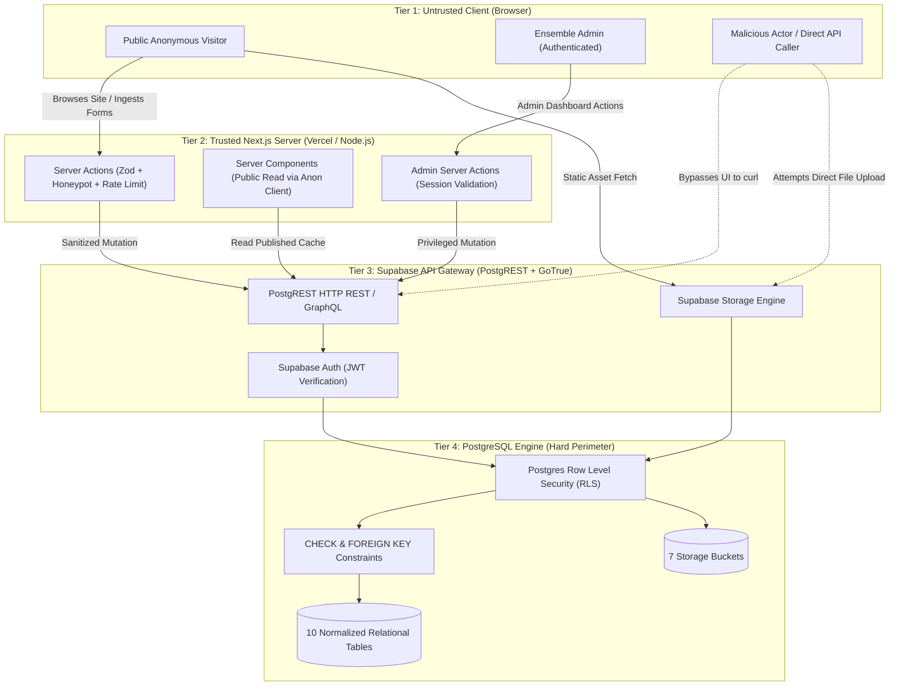

# Andalusia Music Platform — Architectural Security Model

**Specification Reference:** [`DATABASE_SCHEMA.md`](file:///home/mahmoud/Desktop/cms/DATABASE_SCHEMA.md), [`RLS_DESIGN.md`](file:///home/mahmoud/Desktop/cms/RLS_DESIGN.md)  
**Target Environment:** Next.js 15 (App Router) + Supabase Managed PostgreSQL + Supabase Storage  
**Architectural Gate:** Security design strictly validated. **DO NOT IMPLEMENT YET.**

---

## 1. Security Architecture & Threat Landscape

The Andalusia Music Platform pairs a publicly accessible, high-performance web front-end with an administrative content management system and transactional lead ingestion.



---

## 2. Authentication Assumptions & Identity Management

### 2.1 Supabase Auth & JWT Structure
- **Authentication Provider:** Supabase Auth (`GoTrue`) utilizing standard OpenID Connect / OAuth2 JWTs.
- **Identity Storage:** Platform administrators exist exclusively within `auth.users`. No public self-registration is enabled.
- **Role Assignment Location:** Administrative privilege is bound to `app_metadata` inside the Supabase Auth user record:
  ```json
  {
    "sub": "b2f6385a-8b89-4cb4-a3f2-1d5f3a09e1e2",
    "email": "admin@andalusia.art",
    "app_metadata": {
      "provider": "email",
      "role": "admin"
    },
    "user_metadata": {},
    "role": "authenticated",
    "exp": 1773140000
  }
  ```
- **Security Invariant:** `app_metadata` is editable **only** by the Supabase `service_role` (via backend administrative scripts or Supabase Dashboard). It is completely immutable to client `user_metadata` updates.
- **Session Lifecycle:** Short-lived access tokens (60-minute expiry) with cryptographically secure HTTP-only refresh tokens stored in cookies via `@supabase/ssr`.

---

## 3. Role Strategy & Access Control

### 3.1 Evaluated Roles & Justification

| Role Identifier | Context | Justification Verdict | Scope & Permissions |
| :--- | :--- | :---: | :--- |
| `anon` | Public visitors, unauthenticated API callers | **ESSENTIAL** | Read-only access to published content (`is_published = true`). Fallback write-only to `booking_requests` and `newsletter_subscribers` under strict constraint checks. Zero read access to lead tables. |
| `admin` | Ensemble directors, content managers | **ESSENTIAL** | Full CRUD over all 10 schema tables and 7 storage buckets. Full access to triage booking requests and export subscriber lists. |
| `editor` | Dedicated content writers, translators | **DEFERRED (YAGNI)** | Not needed at launch. The platform team consists of 1–2 internal administrators. Speculative multi-role RBAC adds policy overhead without immediate utility. Architecture supports future enablement via `auth.has_role(ARRAY['admin', 'editor'])`. |
| `viewer` | Read-only auditor or stakeholder | **DEFERRED (YAGNI)** | Unnecessary for initial scope. Staging environment or read replica addresses auditor needs. |
| `service_role` | Trusted Next.js Server Actions / Cron jobs | **ESSENTIAL** | Supabase bypass role used exclusively within server-side background processes. Never exposed to browser bundles. |

---

## 4. Multi-Tier Security Boundaries

### 4.1 Boundary Matrix
1. **Tier 1: Client UI Layer**
   - Purely for user experience, form guidance, and instant visual validation.
   - **Zero security assumption:** Hidden fields, disabled buttons, and client-side route guards provide no security protection against determined actors.
2. **Tier 2: Next.js Server Boundary (Server Actions / Route Handlers)**
   - First line of active server defense.
   - Executes Zod schema parsing, field length validation, bot detection (honeypot fields), and IP-based rate limiting.
   - Decouples untrusted client inputs from raw database queries.
3. **Tier 3: Supabase Gateway (PostgREST)**
   - Enforces HTTP method restrictions, payload size caps (max 10MB default), and header parsing.
   - Extracts JWT tokens and sets `auth.uid()` and `auth.jwt()` session variables for PostgreSQL execution.
4. **Tier 4: PostgreSQL Engine (RLS & Schema Engine)**
   - The absolute, non-bypassable security boundary.
   - PostgreSQL executes RLS policies on every query. If an attacker possesses the public `anon` API key and curls PostgREST directly, RLS guarantees zero unpublished records are exposed and zero CRM leads can be read.

---

## 5. Direct Supabase Access Risks & Mitigations

Because Supabase applications expose the `NEXT_PUBLIC_SUPABASE_URL` and `NEXT_PUBLIC_SUPABASE_ANON_KEY` in client-side JavaScript bundles, attackers can bypass the Next.js front-end entirely and issue raw HTTP requests to PostgREST.

### 5.1 Identified Direct Access Vectors & Defenses

| Threat Vector | Attack Scenario | RLS / Database Mitigation |
| :--- | :--- | :--- |
| **PII Lead Harvesting** | Attacker queries `GET /rest/v1/booking_requests` or `newsletter_subscribers` using anon key to steal client emails, phones, and event details. | Policy `booking_requests_select_anon_block` specifies `USING (false)`. PostgREST returns `HTTP 200 []` (0 rows) without disclosing table schema or existence of records. |
| **Draft & Unreleased Content Leak** | Attacker queries `GET /rest/v1/articles` to scrape embargoed press releases or unannounced musician signings. | Policy enforces `is_published = true AND published_at <= now()`. Unreleased records are completely invisible to queries. |
| **Orphan Media Exposure** | Attacker queries `GET /rest/v1/tracks` to download unreleased studio audio stems of a draft artist. | Policy joins parent `artists` table: `EXISTS (SELECT 1 FROM artists WHERE id = tracks.artist_id AND is_published = true)`. |
| **Lead Injection & Defacement** | Attacker issues `POST /rest/v1/booking_requests` with malicious payloads like `{"status": "confirmed", "admin_notes": "VIP free access"}`. | Policy `WITH CHECK (status = 'pending' AND admin_notes IS NULL)` rejects any attempt to tamper with triage status or inject staff notes. |
| **Mass Spam / Storage Denial** | Attacker issues 50,000 rapid POST requests to exhaust Supabase database quotas or storage buckets. | Handled at Gateway via rate-limiting + Next.js Server Action mediation; direct storage upload is blocked by `storage_admin_insert` (admin-only). |

---

## 6. Next.js Server Action Risks & Hardening

Next.js Server Actions create publicly accessible HTTP POST endpoints identified by cryptographic hashes. They must be defended as public APIs.

### 6.1 Server Action Threat Analysis

- **Risk 1: Unauthenticated Administrative Actions**
  - *Threat:* Invoking an admin Server Action (e.g. `updateArtistAction`) directly via POST without verifying user identity.
  - *Defense:* Every administrative Server Action must create an authenticated Supabase client using `@supabase/ssr`, invoke `supabase.auth.getUser()`, and assert that the user possesses `app_metadata.role === 'admin'`. Never rely on client-provided user IDs.
- **Risk 2: Service Role Key Leakage**
  - *Threat:* Instantiating a `createClient` using `SUPABASE_SERVICE_ROLE_KEY` inside a client component or accidentally bundling it into client assets.
  - *Defense:* `SUPABASE_SERVICE_ROLE_KEY` must never carry the `NEXT_PUBLIC_` prefix. Next.js App Router enforces compile-time errors if non-public environment variables are referenced in Client Components (`"use client"`).
- **Risk 3: Bypassing Database RLS via Service Role**
  - *Threat:* Using `service_role` in general Server Actions indiscriminately bypasses all RLS policies, re-introducing SQL/data corruption bugs if validation is skipped.
  - *Defense:* Use the standard authenticated/scoped client (`createClient()` with user session cookies) by default. Restrict `service_role` usage strictly to background jobs, webhook handlers, and initial admin seeding.
- **Risk 4: Unvalidated Input Payloads**
  - *Threat:* Injection of arbitrary strings, prototype pollution, or oversized payloads into form submissions.
  - *Defense:* All Server Actions must parse inbound form data using strict Zod schemas (`safeParse`) matching the exact database constraints (e.g., regex email validation, string length caps, enum checks).
- **Risk 5: Automated Form Spam & Bot Submission**
  - *Threat:* Scripted bots spamming the `/booking` form and `/academy` newsletter subscription.
  - *Defense:* Implement zero-friction honeypot fields (`hp_company_field` hidden via CSS; rejected if filled) combined with Cloudflare Turnstile / IP rate limiting in the Server Action before database insertion.

---

## 7. Storage Security & File Upload Boundaries

### 7.1 Attack Vectors & Mitigations

- **Unrestricted File Uploads (Web Shells / Executables):**
  - *Risk:* Uploading `.php`, `.sh`, `.exe`, or malicious `.svg` files containing embedded XSS scripts.
  - *Defense:* Supabase Storage buckets restrict `allowed_mime_types` strictly to `image/jpeg`, `image/png`, `image/webp` for visual assets, and `audio/mpeg`, `audio/ogg`, `audio/wav` for audio. SVG uploads are excluded from user-controllable buckets.
- **Unbounded Storage Exhaustion:**
  - *Risk:* Uploading 500MB video/binary files to exhaust project storage limits.
  - *Defense:* `max_file_size` is strictly enforced at the bucket level (5 MB for image buckets, 20 MB for audio bucket).
- **Client Direct Upload vs Server Mediation:**
  - Public visitors have **zero upload rights** to any storage bucket (`storage_admin_insert` requires `auth.is_admin()`). Public forms accept only structured text, dates, and contact data—no visitor file attachments exist in the Figma specifications.

---

## 8. Summary of Defense-in-Depth Checklist

- [x] RLS enabled and forced on all 10 schema tables.
- [x] Anonymous public access restricted strictly to published records.
- [x] CRM inbound tables completely inaccessible to public SELECT queries.
- [x] Scheduled articles protected by temporal query checks (`published_at <= now()`).
- [x] Child track and release visibility bound to published parent artists.
- [x] Storage buckets locked to admin-only write/delete.
- [x] Role claims isolated inside immutable `app_metadata`.
- [x] Server Actions protected by Zod schemas, honeypots, and session verification.
- [x] Service role key completely isolated from client bundles.
