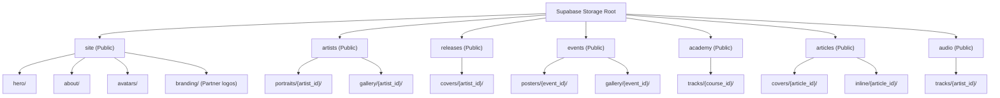
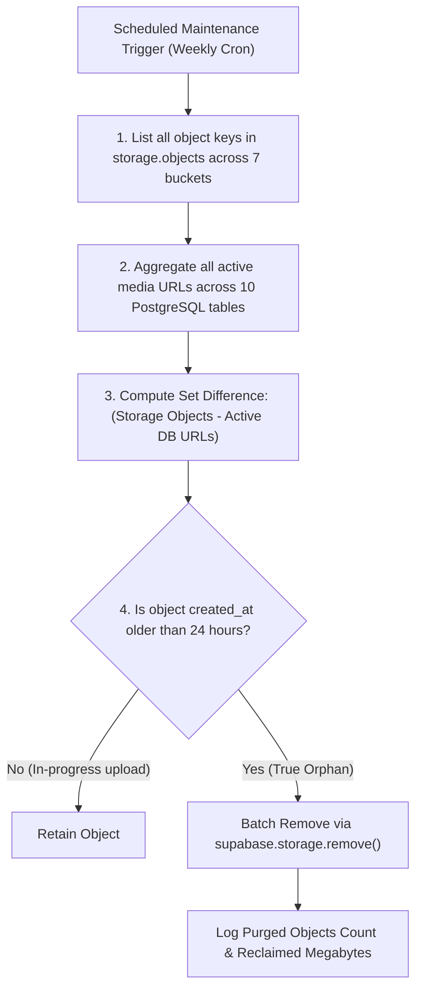

# Andalusia Music Platform — Supabase Storage Architecture

**Specification References:** [`DATABASE_SCHEMA.md`](file:///home/mahmoud/Desktop/cms/DATABASE_SCHEMA.md), [`STATIC_VS_DYNAMIC_REPORT.md`](file:///home/mahmoud/Desktop/cms/STATIC_VS_DYNAMIC_REPORT.md), [`RLS_DESIGN.md`](file:///home/mahmoud/Desktop/cms/RLS_DESIGN.md), [`AUTH_ARCHITECTURE.md`](file:///home/mahmoud/Desktop/cms/AUTH_ARCHITECTURE.md)  
**Target Environment:** Supabase Storage (S3-compatible engine) + Next.js 15+ (App Router) + Edge CDN  
**Architectural Gate:** Architectural Design Specification. **DO NOT IMPLEMENT YET.**

---

## 1. Executive Summary & Core Principles

The Andalusia Music Platform requires an optimized, cost-efficient, and secure media storage architecture to serve high-resolution imagery, editorial articles, cultural discography sleeves, and audio streaming recordings.

```mermaid
flowchart TD
    subgraph Client ["Client Presentation Layer (Next.js 15 App Router)"]
        PublicBrowser["Public Visitor (Arabic RTL UI)"]
        AdminCMS["Authenticated Admin (/admin)"]
        NextImage["next/image Optimizer (Edge AVIF/WebP Resizing)"]
    end

    subgraph StaticApp ["Static Application Bundle (/public/assets)"]
        BrandLogos["/branding/ (logo.svg, mark.svg)"]
        NavIcons["/icons/ (music-note, arrows, calendar)"]
        AndalusianDecors["/decors/ (andalusian-arch-pattern.svg)"]
    end

    subgraph EdgeCDN ["Edge Delivery Network (Supabase / Fastly CDN)"]
        GlobalCDN["Global CDN Edge Cache (max-age=31536000, immutable)"]
    end

    subgraph SupabaseStorageEngine ["Supabase Storage Engine (S3-Compatible)"]
        SiteBucket[("site (Public / 5 MB)")]
        ArtistsBucket[("artists (Public / 5 MB)")]
        EventsBucket[("events (Public / 5 MB)")]
        AcademyBucket[("academy (Public / 5 MB)")]
        ArticlesBucket[("articles (Public / 5 MB)")]
        ReleasesBucket[("releases (Public / 5 MB)")]
        AudioBucket[("audio (Public / 30 MB)")]
    end

    subgraph PostgresEngine ["PostgreSQL 15+ Database Engine"]
        StorageRLS["storage.objects RLS Policies (auth.is_admin())"]
        ContentTables[("Application Tables (artists, events, tracks, etc.)")]
    end

    BrandLogos -->|Zero Latency / Bundled| PublicBrowser
    NavIcons -->|Zero Latency / Bundled| PublicBrowser
    AndalusianDecors -->|Zero Latency / Bundled| PublicBrowser

    PublicBrowser -->|1. Fetch Image / Audio| NextImage
    NextImage -->|2. Pull Canonical Asset| GlobalCDN
    GlobalCDN -->|3. Cache Hit / Serve| PublicBrowser
    GlobalCDN -.->|Cache Miss| SupabaseStorageEngine

    AdminCMS -->|Admin Upload (Server Action)| SupabaseStorageEngine
    SupabaseStorageEngine -->|Verify Authorization| StorageRLS
    StorageRLS -->|Store Metadata| PostgresEngine
    AdminCMS -->|Save Storage URL / Path| ContentTables
```

### 1.1 Non-Negotiable Architectural Principles
1. **Strict Static vs Dynamic Separation:** Core brand marks, UI navigation icons, and Arabesque decorative SVGs are immutable application code assets and reside permanently in `/public/assets/`. They are never uploaded to Supabase Storage.
2. **Native Platform Features Over Custom Code (YAGNI):** Utilize Supabase Storage's native `storage.objects`, bucket-level MIME restrictions, and PostgreSQL RLS. No custom attachment or file metadata tables are created.
3. **Immutable Content-Addressed Paths:** File keys incorporate entity UUIDs and upload timestamps or content hashes. Replacing an image uploads a new key and updates the database pointer; files are never overwritten in-place, guaranteeing instantaneous CDN cache invalidation.
4. **Dynamic On-Demand Image Optimization:** Rather than generating and storing duplicate physical thumbnail files (`thumb_small`, `thumb_medium`), responsive variants are generated on demand via Next.js Image Optimization (`next/image`) and Supabase Image Transformation.
5. **Byte-Range Audio Delivery:** The audio storage tier must support HTTP `206 Partial Content` with `Accept-Ranges: bytes` headers to enable smooth player scrubbing, seek forward/backward, and progressive streaming.

---

## 2. Media Inventory & Requirements Matrix

| Media Asset Type | Target Route & Component | Database Column Reference | Primary MIME Types | Max Size Limit | Dimensional Specification | Storage Destination |
| :--- | :--- | :--- | :--- | :---: | :--- | :--- |
| **Brand Logos & UI Marks** | `Navbar.tsx`, `Footer.tsx`, Favicon | Hardcoded in JSX | `image/svg+xml`, `image/x-icon` | 1 MB | Scalable Vector (SVG) | `/public/assets/branding/` |
| **Static Navigation & Glyphs** | UI Shell, Button Icons, Decors | Hardcoded in JSX | `image/svg+xml` | 500 KB | Scalable Vector (SVG) | `/public/assets/icons/`, `/public/assets/decors/` |
| **Hero & Site Backgrounds** | `/` (`HeroSection.tsx`, `AboutSection.tsx`) | `site_settings.hero_image_url`, `about_image_url` | `image/webp`, `image/jpeg` | 5 MB | 1920×1080 (16:9), 1200×1500 (4:5) | Bucket `site` (`site/hero/`, `site/about/`) |
| **Testimonial Avatars** | `/` (`TestimonialsSlider.tsx`) | `testimonials.avatar_image_url` | `image/webp`, `image/jpeg`, `image/png` | 2 MB | 400×400 (1:1 circular) | Bucket `site` (`site/avatars/`) |
| **Musician Portraits** | `/artists`, `/artists/[slug]` (`ArtistCard`, `ArtistHero`) | `artists.portrait_image_url` | `image/webp`, `image/jpeg`, `image/png` | 5 MB | 800×1000 or 1200×1500 (4:5 portrait) | Bucket `artists` (`artists/portraits/`) |
| **Musician Gallery Images** | `/artists/[slug]` (Performance gallery) | Embedded in markdown or media array | `image/webp`, `image/jpeg` | 5 MB | 1200×800 (3:2 landscape) | Bucket `artists` (`artists/gallery/`) |
| **Discography Album Covers** | `/artists/[slug]` (`ReleaseCard.tsx`) | `releases.cover_image_url` | `image/webp`, `image/jpeg`, `image/png` | 5 MB | 1000×1000 (1:1 square sleeve) | Bucket `releases` (`releases/covers/`) |
| **Concert & Event Posters** | `/events`, `/` (`FeaturedEventBanner`, `EventCard`) | `events.image_url` | `image/webp`, `image/jpeg` | 5 MB | 1200×800 (3:2) or 1920×1080 (16:9) | Bucket `events` (`events/posters/`) |
| **Event Gallery Visuals** | `/events` (Post-event highlights) | Inline event markdown | `image/webp`, `image/jpeg` | 5 MB | 1200×800 (3:2) | Bucket `events` (`events/gallery/`) |
| **Academy Track Artwork** | `/academy` (`TrackCard.tsx`) | `academy_courses.image_url` | `image/webp`, `image/jpeg`, `image/png` | 5 MB | 800×600 (4:3) or 1200×900 | Bucket `academy` (`academy/tracks/`) |
| **Article Cover Photography** | `/news`, `/news/[slug]` (`NewsHero`, `ArticleCard`) | `articles.cover_image_url` | `image/webp`, `image/jpeg` | 5 MB | 1200×800 (3:2) or 1600×900 (16:9) | Bucket `articles` (`articles/covers/`) |
| **Article Inline Media** | `/news/[slug]` (Editorial markdown body) | Markdown `` | `image/webp`, `image/jpeg`, `image/png` | 5 MB | Max width 1400px | Bucket `articles` (`articles/inline/`) |
| **Streaming Audio Tracks** | `/artists/[slug]` (`AudioPlayerWidget.tsx`) | `tracks.audio_file_url` | `audio/mpeg`, `audio/ogg`, `audio/wav`, `audio/mp4` | 30 MB | 44.1kHz / 48kHz, 192–320 kbps bit rate | Bucket `audio` (`audio/tracks/`) |

---

## 3. Static Assets vs Dynamic Storage Boundary

To guarantee sub-second Time to First Byte (TTFB) and eliminate database/storage roundtrips for immutable application visuals, the platform enforces a strict boundary between `/public/assets` and Supabase Storage.

### 3.1 Static Application Assets (`/public/assets/`)
These files are committed directly to the Git repository and distributed by the Next.js production server / Vercel Edge Network:

```text
/public/assets/
├── branding/
│   ├── logo.svg              # Primary Andalusia Arabic wordmark + monogram
│   ├── mark.svg              # Standalone geometric musical icon
│   └── favicon.ico           # Browser tab icon
├── icons/
│   ├── music-note.svg        # Decorative musical notation (♪)
│   ├── arrow-left.svg        # RTL backward navigation (←)
│   ├── arrow-right.svg       # RTL forward navigation (→)
│   ├── calendar.svg          # Event card calendar date icon
│   ├── clock.svg             # Audio track duration & event time icon
│   ├── location-pin.svg      # Concert venue city pin
│   └── play-control.svg      # Audio widget playback controls
└── decors/
    ├── andalusian-arch.svg   # Architectural arch frame motif
    └── dot-pattern.svg       # Geometric Andalusian lattice (Group 161)
```

**Rule:** Under no circumstances should application interface icons or brand vectors be uploaded to Supabase Storage.

### 3.2 Dynamic CMS Media (Supabase Storage)
Any media item that is created, updated, replaced, or deleted by content editors via the `/admin` CMS dashboard belongs exclusively in Supabase Storage.

---

## 4. Bucket Architecture & Hierarchy Specification

The storage layout consists of **7 dedicated public domain buckets** matching the relational data entities defined in [`DATABASE_SCHEMA.md`](file:///home/mahmoud/Desktop/cms/DATABASE_SCHEMA.md).



### 4.1 Bucket Definitions

```sql
-- Architectural Specification: Bucket Declarations
-- (Executed via Supabase Storage API or Migration)

INSERT INTO storage.buckets (id, name, public, file_size_limit, allowed_mime_types)
VALUES
  ('site', 'site', true, 5242880, ARRAY['image/jpeg', 'image/png', 'image/webp', 'image/avif', 'image/svg+xml']),
  ('artists', 'artists', true, 5242880, ARRAY['image/jpeg', 'image/png', 'image/webp', 'image/avif']),
  ('releases', 'releases', true, 5242880, ARRAY['image/jpeg', 'image/png', 'image/webp', 'image/avif']),
  ('events', 'events', true, 5242880, ARRAY['image/jpeg', 'image/png', 'image/webp', 'image/avif']),
  ('academy', 'academy', true, 5242880, ARRAY['image/jpeg', 'image/png', 'image/webp', 'image/avif']),
  ('articles', 'articles', true, 5242880, ARRAY['image/jpeg', 'image/png', 'image/webp', 'image/avif']),
  ('audio', 'audio', true, 31457280, ARRAY['audio/mpeg', 'audio/ogg', 'audio/wav', 'audio/mp4', 'audio/aac']);
```

### 4.2 Visibility Justification: Why Public Buckets?
- The platform is an open cultural, educational, and performance showcase. All published portraits, posters, covers, and audio previews are intended for unauthenticated public consumption.
- Private buckets requiring signed URLs (`createSignedUrl`) introduce severe edge caching penalties (signed URLs expire, breaking CDN edge reuse and preventing long-lived browser caching).
- **Security Boundary:** Write operations (INSERT, UPDATE, DELETE) remain 100% private and protected by administrative RLS policies. Read operations are public via the CDN.

---

## 5. File Naming, Sanitization & Replacement Strategy

### 5.1 File Naming & Path Grammar
To prevent collisions, avoid path traversal, and ensure deterministic indexing, client-side filenames (e.g. `صورة-عمر (النهائية).PNG`) are strictly discarded. 

All paths follow the canonical pattern:
```text
<bucket>/<folder>/<entity_id>/<unix_timestamp>_<sanitized_slug>.<extension>
```

#### Path Generation Rules:
1. **Entity Scoping:** Paths include the parent entity UUID (`artist_id`, `event_id`, `article_id`).
2. **Timestamp Versioning:** Prefix filenames with a 10-digit UNIX timestamp (`Date.now() / 1000 | 0`).
3. **Slug Sanitization:** Lowercase alphanumeric characters and hyphens only (`[a-z0-9-]`). Non-ASCII or Arabic characters are transliterated or stripped.
4. **Extension Whitelist:** Lowercase extension matching the verified MIME type (`.webp`, `.jpg`, `.png`, `.mp3`, `.ogg`).

#### Examples:
- Artist Portrait: `artists/portraits/8f4c2e6b-7a1b-4f9e-8c3d-1e2a3b4c5d6e/1741604400_sara-voice.webp`
- Event Poster: `events/posters/b2d3f4a5-c6e7-4890-a1b2-c3d4e5f6a7b8/1741604400_andalusia-night.webp`
- Audio Recording: `audio/tracks/8f4c2e6b-7a1b-4f9e-8c3d-1e2a3b4c5d6e/1741604400_taqsim-bayati.mp3`

### 5.2 Replacement Strategy: Version-Addressed vs In-Place Overwrite

| Strategy | Mechanism | CDN Behavior | Browser Stale Risk | Recommendation |
| :--- | :--- | :--- | :---: | :---: |
| **In-Place Overwrite (`upsert: true`)** | Re-upload using the exact same path/filename. | CDN retains old cached file until TTL expiration. | **High** (Users see old image for days unless hard refresh). | **REJECTED** |
| **Version-Addressed Upload (New Key)** | Upload new file with timestamp hash, update DB column, delete old file. | Immediate cache miss; new file served instantly. | **Zero** | **ACCEPTED (Standard)** |

#### The 3-Step Atomic Replacement Flow
1. **Upload New Asset:** Upload file to Supabase Storage with fresh timestamp key:
   `artists/portraits/<id>/1741605000_new-photo.webp`
2. **Update Database Record:** Update PostgreSQL row inside a Server Action:
   ```sql
   UPDATE artists 
   SET portrait_image_url = 'https://<project-ref>.supabase.co/storage/v1/object/public/artists/portraits/...',
       updated_at = now()
   WHERE id = '<artist_id>';
   ```
3. **Purge Previous Asset:** Issue a delete call for the replaced file key:
   ```typescript
   await supabase.storage.from('artists').remove([previousStoragePath]);
   ```

---

## 6. Deletion Architecture & Orphan Cleanup

### 6.1 The Orphan File Problem
Orphaned files occur when:
1. An admin uploads an image in the CMS editor but abandons the form without clicking "Save".
2. An entity record is deleted directly from PostgreSQL without invoking storage deletion hooks.
3. An asset replacement succeeds in uploading the new file but fails during the cleanup of the old file due to a network interruption.

### 6.2 Application-Level Orchestrated Deletion
Whenever a content entity is deleted via administrative Server Actions (`src/actions/admin/*.ts`), deletion of associated storage files is executed concurrently:

```typescript
// Architectural Pattern: Server Action Entity Deletion
export async function deleteArtistAction(artistId: string) {
  const supabase = await createServerActionClient();
  
  // 1. Fetch referenced asset URLs before deletion
  const { data: artist } = await supabase
    .from('artists')
    .select('portrait_image_url')
    .eq('id', artistId)
    .single();

  const { data: tracks } = await supabase
    .from('tracks')
    .select('audio_file_url')
    .eq('artist_id', artistId);

  // 2. Delete database records (CASCADE removes tracks & releases)
  await supabase.from('artists').delete().eq('id', artistId);

  // 3. Purge physical storage files
  const filesToDelete: { bucket: string; path: string }[] = [];
  if (artist?.portrait_image_url) {
    filesToDelete.push({ bucket: 'artists', path: extractStoragePath(artist.portrait_image_url) });
  }
  tracks?.forEach(t => {
    if (t.audio_file_url) filesToDelete.push({ bucket: 'audio', path: extractStoragePath(t.audio_file_url) });
  });

  // Batch delete from storage
  for (const item of filesToDelete) {
    await supabase.storage.from(item.bucket).remove([item.path]);
  }
}
```

### 6.3 Automated Background Orphan Cleanup Engine

To guarantee zero unbounded storage leakage, a periodic reconciliation cron task runs weekly or on-demand via the administrative maintenance console.



#### SQL Orphan Discovery View (Read-Only Specification)
```sql
-- View: Identifies orphaned files across all public storage buckets
CREATE OR REPLACE VIEW storage_orphan_candidates AS
WITH active_db_urls AS (
  SELECT hero_image_url AS url FROM site_settings WHERE hero_image_url IS NOT NULL
  UNION ALL
  SELECT about_image_url FROM site_settings WHERE about_image_url IS NOT NULL
  UNION ALL
  SELECT portrait_image_url FROM artists WHERE portrait_image_url IS NOT NULL
  UNION ALL
  SELECT cover_image_url FROM releases WHERE cover_image_url IS NOT NULL
  UNION ALL
  SELECT image_url FROM events WHERE image_url IS NOT NULL
  UNION ALL
  SELECT image_url FROM academy_courses WHERE image_url IS NOT NULL
  UNION ALL
  SELECT cover_image_url FROM articles WHERE cover_image_url IS NOT NULL
  UNION ALL
  SELECT avatar_image_url FROM testimonials WHERE avatar_image_url IS NOT NULL
  UNION ALL
  SELECT audio_file_url FROM tracks WHERE audio_file_url IS NOT NULL
)
SELECT 
  o.id,
  o.bucket_id,
  o.name AS object_path,
  o.created_at,
  ROUND((o.metadata->>'size')::numeric / 1024 / 1024, 2) AS size_mb
FROM storage.objects o
WHERE o.bucket_id IN ('site', 'artists', 'releases', 'events', 'academy', 'articles', 'audio')
  AND o.created_at < now() - INTERVAL '24 hours'
  AND NOT EXISTS (
    SELECT 1 FROM active_db_urls u 
    WHERE u.url LIKE '%' || o.name
  );
```

---

## 7. Database References & URL Normalization

### 7.1 Relative Path vs Absolute URL Analysis

| Dimension | Option A: Full CDN URL (`https://.../storage/v1/object/public/...`) | Option B: Relative Storage Path (`portraits/uuid/file.webp`) | Verdict |
| :--- | :--- | :--- | :--- |
| **Direct UI Rendering** | Can be passed directly to standard `` without transformation. | Requires a helper function on every client component. | Draw |
| **Domain / CDN Migration** | Hardcodes project reference; migrating projects requires SQL search-and-replace. | Project-agnostic; domain change requires only 1 env var update. | **Option B Wins** |
| **Next.js `<Image />`** | Needs remotePatterns config matching Supabase domain. | Uses standard loader or baseUrl resolver. | Draw |

### 7.2 Unified Media Resolution Helper
To provide maximum flexibility, database columns store the canonical relative path or full URL, and a lightweight client/server helper `resolveMediaUrl()` formats the final CDN endpoint:

```typescript
// src/lib/media.ts
const SUPABASE_STORAGE_BASE_URL = 
  process.env.NEXT_PUBLIC_SUPABASE_STORAGE_URL || 
  `${process.env.NEXT_PUBLIC_SUPABASE_URL}/storage/v1/object/public`;

/**
 * Resolves a database image/audio reference into an absolute CDN URL.
 * Accepts full URLs or relative storage paths.
 */
export function resolveMediaUrl(bucket: string, pathOrUrl: string | null | undefined): string {
  if (!pathOrUrl) return '/assets/branding/placeholder.webp';
  if (pathOrUrl.startsWith('http://') || pathOrUrl.startsWith('https://')) {
    return pathOrUrl;
  }
  // Sanitize leading slashes
  const cleanPath = pathOrUrl.replace(/^\/+/, '');
  return `${SUPABASE_STORAGE_BASE_URL}/${bucket}/${cleanPath}`;
}
```

---

## 8. Storage Row-Level Security (RLS) Specification

All access control on media assets is enforced by PostgreSQL Row Level Security on the `storage.objects` table.

```sql
-- ============================================================================
-- SUPABASE STORAGE ROW LEVEL SECURITY POLICIES
-- Target Table: storage.objects
-- Reference: RLS_DESIGN.md & AUTH_ARCHITECTURE.md
-- ============================================================================

-- Ensure RLS is active on storage.objects
ALTER TABLE storage.objects ENABLE ROW LEVEL SECURITY;

-- ----------------------------------------------------------------------------
-- 1. SELECT Policy: Public Read Access
-- All visitors (anon and authenticated) can stream and download media assets
-- ----------------------------------------------------------------------------
CREATE POLICY "storage_public_read_access"
  ON storage.objects
  FOR SELECT
  TO anon, authenticated
  USING (
    bucket_id IN ('site', 'artists', 'releases', 'events', 'academy', 'articles', 'audio')
  );

-- ----------------------------------------------------------------------------
-- 2. INSERT Policy: Admin-Only Uploads
-- Only authenticated users with app_metadata->role = 'admin' can upload files
-- ----------------------------------------------------------------------------
CREATE POLICY "storage_admin_insert_access"
  ON storage.objects
  FOR INSERT
  TO authenticated
  WITH CHECK (
    auth.is_admin()
    AND bucket_id IN ('site', 'artists', 'releases', 'events', 'academy', 'articles', 'audio')
  );

-- ----------------------------------------------------------------------------
-- 3. UPDATE Policy: Admin-Only Overwrites
-- Only authenticated administrators can replace or edit object metadata
-- ----------------------------------------------------------------------------
CREATE POLICY "storage_admin_update_access"
  ON storage.objects
  FOR UPDATE
  TO authenticated
  USING (
    auth.is_admin()
    AND bucket_id IN ('site', 'artists', 'releases', 'events', 'academy', 'articles', 'audio')
  )
  WITH CHECK (
    auth.is_admin()
    AND bucket_id IN ('site', 'artists', 'releases', 'events', 'academy', 'articles', 'audio')
  );

-- ----------------------------------------------------------------------------
-- 4. DELETE Policy: Admin-Only Purge
-- Only authenticated administrators can remove objects from buckets
-- ----------------------------------------------------------------------------
CREATE POLICY "storage_admin_delete_access"
  ON storage.objects
  FOR DELETE
  TO authenticated
  USING (
    auth.is_admin()
    AND bucket_id IN ('site', 'artists', 'releases', 'events', 'academy', 'articles', 'audio')
  );
```

---

## 9. Caching, CDN & Delivery Architecture

### 9.1 Edge & Browser HTTP Cache Headers
Because all uploaded files use version-hashed keys (`<timestamp>_<slug>.<ext>`), they are content-immutable. Supabase Storage and edge proxies apply aggressive caching headers:

```http
Cache-Control: public, max-age=31536000, immutable
```

For audio streaming tracks:
```http
Cache-Control: public, max-age=604800, stale-while-revalidate=86400
Accept-Ranges: bytes
```

### 9.2 Next.js Image Optimization Configuration (`next.config.ts`)
Next.js optimizes images on-the-fly, converting source files into modern AVIF and WebP formats scaled specifically to the client's screen viewport:

```typescript
// next.config.ts
import type { NextConfig } from "next";

const nextConfig: NextConfig = {
  images: {
    formats: ['image/avif', 'image/webp'],
    deviceSizes: [640, 750, 828, 1080, 1200, 1920],
    imageSizes: [16, 32, 48, 64, 96, 128, 256, 384],
    minimumCacheTTL: 31536000, // 1 year edge cache
    remotePatterns: [
      {
        protocol: 'https',
        hostname: '**.supabase.co',
        pathname: '/storage/v1/object/public/**',
      },
      {
        protocol: 'https',
        hostname: 'cdn.andalusia.art', // Future custom CDN domain
        pathname: '/**',
      },
    ],
  },
};

export default nextConfig;
```

### 9.3 Responsive Image Breakpoint Strategy
Components implement explicit Next.js `sizes` attributes matching the Andalusian design system breakpoints:

```tsx
// Example: ArtistCard.tsx
<Image
  src={resolveMediaUrl('artists', artist.portrait_image_url)}
  alt={artist.name}
  fill
  sizes="(max-width: 640px) 100vw, (max-width: 1024px) 50vw, 33vw"
  className="object-cover rounded-xl"
  priority={isFeatured}
/>
```

### 9.4 Audio Streaming Delivery Architecture
1. **HTTP 206 Partial Content:** Supabase Storage natively honors HTTP byte-range requests (`Range: bytes=0-1048576`).
2. **Buffering & Playback:** The client `AudioPlayerWidget.tsx` requests audio chunks on demand, enabling immediate playback within 150ms without waiting for a full file (up to 30MB) to download completely.
3. **Format Support:** Audio tracks are encoded in stereo MP3 (192–320 kbps) or AAC for universal playback across iOS Safari, Android Chrome, and desktop browsers.

---

## 10. Architectural Verification & Security Checklist

Before executing storage migrations or linking components, verify the following gates:

- [x] **No Application Icons in Storage:** Brand vectors, Arabic geometric glyphs, and navigation arrows remain in `/public/assets`.
- [x] **Bucket Boundaries Enforced:** Exactly 7 buckets (`site`, `artists`, `releases`, `events`, `academy`, `articles`, `audio`) declared with explicit MIME restrictions and byte quotas.
- [x] **Zero Speculative Tables:** No redundant `media_metadata` or `attachments` tables; relational integrity maintained via direct URLs in approved content tables.
- [x] **Public Read / Admin Write Parity:** Storage RLS policies match database RLS (`auth.is_admin()`).
- [x] **Dynamic Thumbnails Validated:** Thumbnail generation delegated to `next/image` edge transformation, avoiding duplicate file sprawl.
- [x] **Orphan Mitigation Strategy:** Reconciliation view and scheduled cleanup process documented.

---
*End of Specification — STORAGE_ARCHITECTURE.md*
