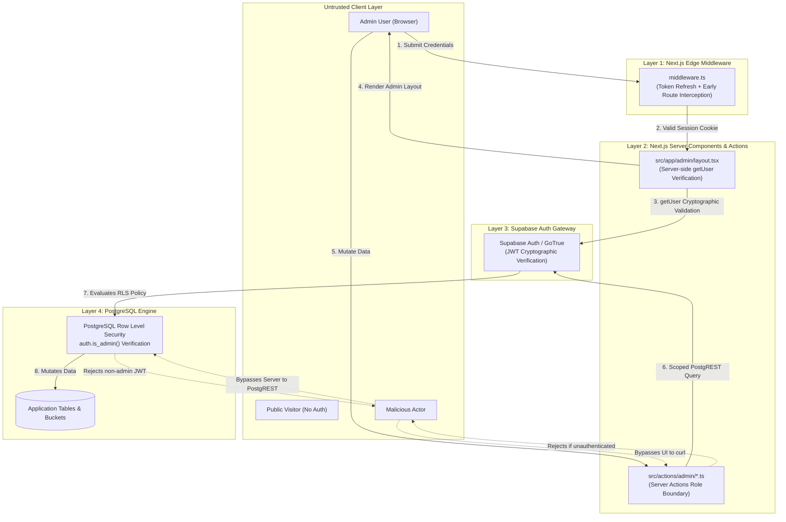
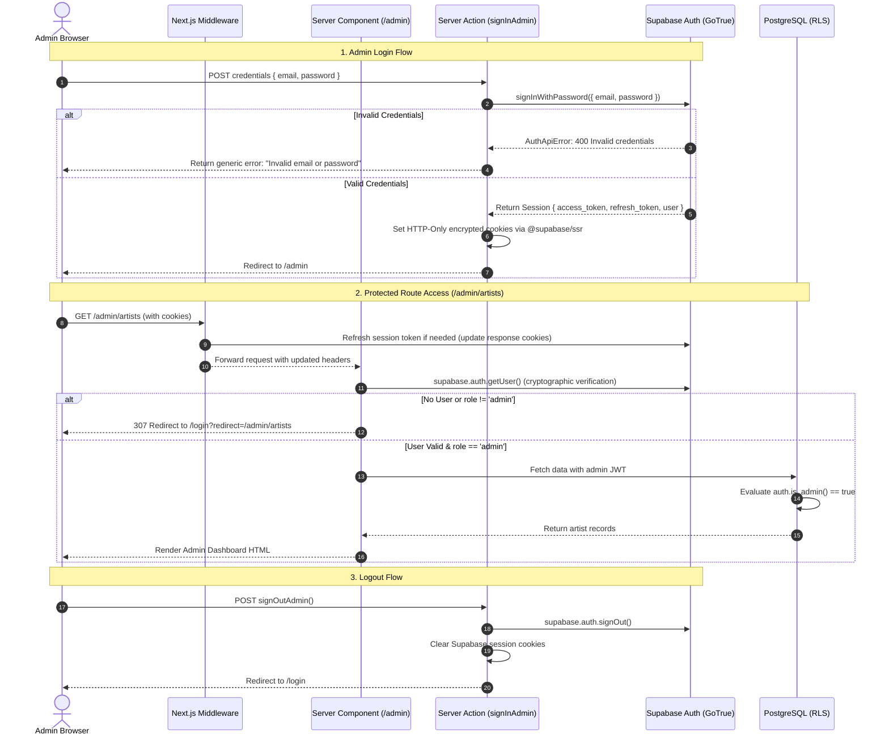
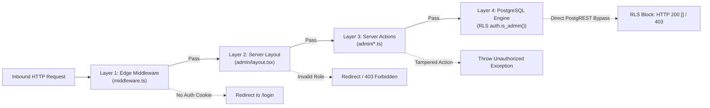

# Andalusia Music Platform — Supabase Authentication Architecture

**Specification References:** [`SECURITY_MODEL.md`](file:///home/mahmoud/Desktop/cms/SECURITY_MODEL.md), [`RLS_DESIGN.md`](file:///home/mahmoud/Desktop/cms/RLS_DESIGN.md), [`DATABASE_SCHEMA.md`](file:///home/mahmoud/Desktop/cms/DATABASE_SCHEMA.md)  
**Target Environment:** Next.js 15+ (App Router) + Supabase Auth (`GoTrue`) + `@supabase/ssr`  
**Architectural Gate:** Architectural Design Specification. **DO NOT IMPLEMENT YET.**

---

## 1. Executive Summary & Core Security Principles

The Andalusia Music Platform pairs an unauthenticated, public-facing cultural portfolio with a private, authenticated administrative management suite located at `/admin`. This document establishes the authentication, session persistence, and authorization architecture using Supabase Auth.



### 1.1 Non-Negotiable Architectural Rules
- **No Client-Only Security:** Hidden elements, conditional React renders, and client `useEffect` route checks do not constitute security. Route access and data mutations must be validated on the server before response transmission.
- **`getUser()` Over `getSession()` on Server:** Server Components, Server Actions, and Route Handlers must validate sessions using `supabase.auth.getUser()`. The local `getSession()` method reads unverified cookie payloads and is strictly prohibited for server-side authorization boundaries.
- **Zero Public Registration:** Self-registration (`signUp`) is permanently disabled. Administrative accounts are seeded or provisioned directly via Supabase CLI or Service Role APIs.
- **Defense in Depth:** Authentication and authorization are enforced across 4 sequential layers: Edge Middleware, Server Component Layouts, Server Actions, and PostgreSQL Row Level Security (RLS).

---

## 2. Minimum Authentication Model Analysis

To prevent over-engineering and adhere to the project's strict YAGNI constraints, this section evaluates potential authentication approaches and selects the absolute minimum viable model.

### 2.1 Model Evaluation Matrix

| Model Alternative | Complexity | Redundancy | Maintenance Cost | Verdict |
| :--- | :---: | :---: | :---: | :--- |
| **A. Full RBAC with Custom Profile Tables**<br>`users` + `roles` + `permissions` tables, public signup disabled, relational joins for every permission check. | High | High (Supabase Auth already manages user identities) | High (Requires custom migration scripts, permission caches, and complex joins) | **REJECTED (Over-engineered)** |
| **B. Third-Party Auth Layer (NextAuth / Auth.js)**<br>External OAuth/Credentials engine bridging to Supabase via custom adapters. | High | High (Duplicates Supabase Auth's native JWT and RLS capabilities) | High (Token synchronization overhead, cookie collision risks) | **REJECTED (Redundant)** |
| **C. Supabase Auth Native Email/Password + `app_metadata.role`**<br>Direct Supabase Auth with email/password, session persistence via `@supabase/ssr` cookies, single administrative role stored in immutable `app_metadata`. | Minimal | None | Minimal (Zero custom tables, native RLS compatibility via `auth.jwt()`) | **SELECTED (Minimum Viable Model)** |

### 2.2 Selected Model Specification
- **Identity Provider:** Supabase Auth (`GoTrue`).
- **Credential Type:** Single factor Email + Password.
- **User Population:** 1–2 ensemble administrators. Zero public end-user accounts.
- **Provisioning Mechanism:** Supabase CLI or Supabase Dashboard via Service Role. No `/signup` or `/register` route exists.
- **Role Storage Location:** `app_metadata` inside the Supabase `auth.users` record:
  ```json
  {
    "provider": "email",
    "role": "admin"
  }
  ```
- **Immutability Guarantee:**
  - `user_metadata` is editable by the authenticated user via `supabase.auth.updateUser()`. It is strictly prohibited for authorization checks.
  - `app_metadata` can **only** be modified by the Supabase `service_role` (via admin CLI, backend scripts, or the Supabase Console). It cannot be forged or modified by the logged-in user.

---

## 3. End-to-End Authentication Flows



### 3.1 Flow Breakdown

#### Flow 1: Admin Login
1. User navigates to [`/login`](file:///home/mahmoud/Desktop/cms/src/app/(auth)/login/page.tsx).
2. Form submits credentials to Server Action `signInAdmin(formData)`.
3. Server Action calls `supabase.auth.signInWithPassword({ email, password })`.
4. On error: Maps GoTrue error to localized Arabic error string (`"بيانات الاعتماد غير صالحة"`) without disclosing whether the email exists.
5. On success: `@supabase/ssr` writes partitioned session cookies (`sb-<ref>-auth-token`) to the response headers with `HttpOnly`, `Secure`, and `SameSite=Lax`.
6. Redirects user to `/admin` or the safe relative URL specified in `redirect` query parameter.

#### Flow 2: Protected Route Navigation
1. Inbound request hits Next.js Edge Middleware [`middleware.ts`](file:///home/mahmoud/Desktop/cms/src/middleware.ts).
2. Middleware refreshes stale tokens via `supabase.auth.getUser()` and synchronizes cookies.
3. If no active session exists on any `/admin/*` path, middleware issues an immediate `307 Redirect` to `/login?redirect=<target_path>`. No login exclusion is needed since `/login` is outside the `/admin/*` route group.
4. If session exists and user targets `/login`, middleware redirects to `/admin`.
5. Request proceeds to [`src/app/(admin)/admin/layout.tsx`](file:///home/mahmoud/Desktop/cms/src/app/(admin)/admin/layout.tsx). Layout executes server-side validation asserting `user.app_metadata.role === 'admin'`.

#### Flow 3: Session Refresh & Expiration
1. Access token expires after 3600 seconds (1 hour).
2. Subsequent request causes `@supabase/ssr` in middleware to detect expiration and invoke token refresh using the HTTP-only refresh token.
3. If refresh token is valid: New tokens are written to response cookies seamlessly without user interruption.
4. If refresh token is revoked, expired, or invalid: `getUser()` returns `null`, middleware strips invalid cookies, and redirects user to `/login?error=session_expired`.

#### Flow 4: Logout
1. User clicks "تسجيل الخروج" (Logout) in Admin Header / Sidebar.
2. Triggers Server Action `signOutAdmin()`.
3. Calls `supabase.auth.signOut({ scope: 'local' })`.
4. Cookies are expired and deleted via `@supabase/ssr`.
5. Revalidates Next.js router cache via `revalidatePath('/admin', 'layout')`.
6. Redirects browser to `/login`.

---

## 4. Session Handling & Token Strategy

### 4.1 Cookie Architecture via `@supabase/ssr`

Next.js 15 App Router requires dedicated cookie synchronization between Server Components, Server Actions, Route Handlers, and Edge Middleware.

| Cookie Parameter | Value | Security Rationale |
| :--- | :--- | :--- |
| **Prefix / Key** | `sb-<project-ref>-auth-token` (chunked) | Standard Supabase SSR storage format. |
| **`HttpOnly`** | `true` | Prevents JavaScript access via `document.cookie`, mitigating XSS token theft. |
| **`Secure`** | `true` (Production) / `false` (Localhost) | Restricts cookie transmission strictly to HTTPS channels. |
| **`SameSite`** | `Lax` | Protects against Cross-Site Request Forgery (CSRF) during navigation while allowing top-level redirects. |
| **`Path`** | `/` | Accessible across middleware and all route handlers. |
| **`Max-Age`** | 604800 (7 days) | Aligned with Supabase refresh token rotation window. |

### 4.2 Critical Security Boundary: `getUser()` vs `getSession()`

```
+-------------------------------------------------------------------------------+
| CRITICAL ARCHITECTURAL REQUIREMENT:                                           |
| NEVER rely on supabase.auth.getSession() inside Server Components or Actions. |
+-------------------------------------------------------------------------------+
```

- **`supabase.auth.getSession()`**:
  - Simply deserializes the JWT payload from the incoming cookie without validating its cryptographic signature or checking revocation against the Supabase Auth server.
  - Vulnerable to spoofing if cookies are tampered with or if the user was deleted/suspended in the Supabase backend.
- **`supabase.auth.getUser()`**:
  - Transmits the JWT to the Supabase Auth server (`GoTrue`) to verify the signature, ensure the token is not expired, verify the user account is active, and retrieve fresh `app_metadata`.
  - Mandatory for all server-side authorization gates.

---

## 5. Multi-Layer Route Protection Architecture

Defense-in-depth ensures that a failure or bypass at any single layer does not compromise administrative data.



### 5.1 Defense Layer Details

#### Layer 1: Edge Middleware (`src/middleware.ts`)
- Executes on the Edge before Next.js begins rendering or executing server logic.
- Inspects request pathname against pattern: `/admin/*` (static assets and favicon are excluded). Since `/login` is in the `(auth)` route group, no login-path exclusion is needed.
- Calls `supabase.auth.getUser()` to refresh session cookies.
- If unauthenticated: Redirects immediately to `/login?redirect=${encodeURIComponent(pathname)}`.
- If authenticated visitor hits `/login`: Redirects directly to `/admin`.

#### Layer 2: Server Component Layout (`src/app/admin/layout.tsx`)
- Enforces layout-level server authorization before rendering children components.
- Instantiates server Supabase client via `createServerClient`.
- Calls `supabase.auth.getUser()`.
- Validates that `user.app_metadata.role === 'admin'`.
- If invalid: Calls `redirect('/login')`.

#### Layer 3: Server Actions Boundary (`src/actions/admin/*.ts`)
- Protects all administrative mutations (`createArtist`, `updateEvent`, `triageBooking`, `deleteRelease`).
- Every Server Action must invoke an auth guard utility:
  ```typescript
  // Contract for Action Authorization Guard
  export async function requireAdminSession() {
    const supabase = await createServerClient();
    const { data: { user }, error } = await supabase.auth.getUser();
    if (error || !user || user.app_metadata?.role !== 'admin') {
      throw new Error('UNAUTHORIZED_ADMIN_ACTION');
    }
    return { supabase, user };
  }
  ```
- Prevents direct execution of Server Actions via forged HTTP POST requests.

#### Layer 4: PostgreSQL Row Level Security (`auth.is_admin()`)
- The non-bypassable perimeter defined in [`RLS_DESIGN.md`](file:///home/mahmoud/Desktop/cms/RLS_DESIGN.md).
- Enforced directly by the database engine for all 10 schema tables and 7 storage buckets:
  ```sql
  CREATE OR REPLACE FUNCTION auth.is_admin()
  RETURNS BOOLEAN
  LANGUAGE sql
  STABLE
  SECURITY DEFINER
  SET search_path = public
  AS $$
    SELECT COALESCE(
      (auth.jwt() -> 'app_metadata' ->> 'role') = 'admin',
      false
    );
  $$;
  ```
- Even if Next.js middleware and server checks were completely bypassed by an attacker holding the `anon` key, PostgREST requests fail RLS checks and return zero records.

---

## 6. Route Protection Matrix & URL Boundaries

| Route Pattern | Protection Level | Guard Location | Behavior for Unauthenticated | Behavior for Authenticated Admin |
| :--- | :---: | :--- | :--- | :--- |
| `/` | Public | None | Normal render | Normal render |
| `/artists`, `/artists/*` | Public | None | Normal render | Normal render |
| `/events` | Public | None | Normal render | Normal render |
| `/academy` | Public | None | Normal render | Normal render |
| `/news`, `/news/*` | Public | None | Normal render | Normal render |
| `/booking` | Public | None | Normal render | Normal render |
| `/login` | Unauthenticated Only | Middleware + Page | Normal render (shows login form) | Redirect to `/admin` |
| `/admin` | **Protected (Admin)** | Middleware + Layout | Redirect to `/login?redirect=/admin` | Normal render (Dashboard) |
| `/admin/artists/**` | **Protected (Admin)** | Middleware + Layout + Action | Redirect to `/login?redirect=/admin/artists` | Full CRUD |
| `/admin/events/**` | **Protected (Admin)** | Middleware + Layout + Action | Redirect to `/login?redirect=/admin/events` | Full CRUD |
| `/admin/tracks/**` | **Protected (Admin)** | Middleware + Layout + Action | Redirect to `/login?redirect=/admin/tracks` | Full CRUD |
| `/admin/releases/**`| **Protected (Admin)** | Middleware + Layout + Action | Redirect to `/login?redirect=/admin/releases`| Full CRUD |
| `/admin/news/**` | **Protected (Admin)** | Middleware + Layout + Action | Redirect to `/login?redirect=/admin/news` | Full CRUD |
| `/admin/academy/**` | **Protected (Admin)** | Middleware + Layout + Action | Redirect to `/login?redirect=/admin/academy` | Full CRUD |
| `/admin/testimonials/**`| **Protected (Admin)** | Middleware + Layout + Action | Redirect to `/login?redirect=/admin/testimonials`| Full CRUD |
| `/admin/bookings/**`| **Protected (Admin)** | Middleware + Layout + Action | Redirect to `/login?redirect=/admin/bookings` | View & Triage Inquiries |
| `/admin/subscribers`| **Protected (Admin)** | Middleware + Layout + Action | Redirect to `/login?redirect=/admin/subscribers`| View & Export |
| `/admin/media` | **Protected (Admin)** | Middleware + Layout + Action | Redirect to `/login?redirect=/admin/media` | Browse Bucket Assets |
| `/admin/settings` | **Protected (Admin)** | Middleware + Layout + Action | Redirect to `/login?redirect=/admin/settings` | Edit Singleton Settings |

---

## 7. Error Handling, Edge Cases & Threat Mitigations

### 7.1 Invalid Credentials & Enumeration Prevention
- **Threat:** Malicious actors submitting credentials to enumerate administrative email addresses.
- **GoTrue Behavior:** Returns `400 Bad Request` with message `Invalid login credentials`.
- **Architectural Handling:**
  - The login action intercepts all auth errors and responds with an identical generic message: `"البريد الإلكتروني أو كلمة المرور غير صحيحة"` ("Invalid email or password").
  - Form UI does not differentiate between "user does not exist" and "wrong password".
  - Login attempts are rate-limited via Supabase GoTrue built-in IP throttling (max 30 requests per minute).

### 7.2 Expired Session Handling
- **Scenario:** Admin leaves browser tab open past access token expiry (60 minutes).
- **Resolution:**
  - Inbound request triggers `@supabase/ssr` token refresh in middleware.
  - If refresh fails (e.g., refresh token revoked or older than 7 days):
    - Clear auth cookies.
    - Redirect to `/login?error=session_expired`.
    - UI presents high-contrast notification: `"انتهت الجلسة، يرجى تسجيل الدخول مجددًا"` ("Session expired, please log in again").

### 7.3 Unauthorized Redirect Loop Prevention
- **Risk:** Incomplete cookie clearing causing infinite redirect between `/admin` and `/login`.
- **Mitigation:**
  - Middleware explicitly tests if request pathname is exactly `/login`.
  - If `getUser()` returns valid admin on `/login`, redirect to `/admin`.
  - If `getUser()` returns null or non-admin on `/admin/*` (not `/login`), redirect to `/login`.
  - Prevents recursive rewrite loops.

### 7.4 Open Redirect Defense on `redirect` Parameter
- **Threat:** Attacker crafts phishing link: `/login?redirect=https://evil-site.com`.
- **Mitigation:** Server Action validates the `redirect` query parameter before redirecting:
  ```typescript
  function getSafeRedirectUrl(target: string | null): string {
    if (!target) return '/admin';
    // Must start with '/' and must not start with '//' or contain protocol
    if (target.startsWith('/') && !target.startsWith('//') && !target.includes(':')) {
      return target;
    }
    return '/admin';
  }
  ```

---

## 8. Directory Structure & Implementation Blueprint

```
src/
├── actions/
│   └── auth.ts                      # Server Actions: signInAdmin, signOutAdmin
├── app/
│   ├── (auth)/
│   │   └── login/
│   │       ├── layout.tsx           # Minimal, distraction-free auth shell
│   │       └── page.tsx             # RTL Admin Login Form (/login)
│   └── (admin)/
│       └── admin/
│           ├── layout.tsx           # Admin Shell + Server-Side getUser() Guard
│           ├── page.tsx             # Admin Dashboard Overview
│           ├── artists/             # Admin Artist Module
│           ├── events/              # Admin Events Module
│           ├── tracks/              # Admin Tracks Module
│           ├── releases/            # Admin Releases Module
│           ├── news/                # Admin News Module
│           ├── academy/             # Admin Academy Module
│           ├── testimonials/        # Admin Testimonials Module
│           ├── bookings/            # Admin CRM Bookings Module
│           ├── subscribers/         # Admin Subscribers Module
│           ├── media/               # Admin Media Browser Module
│           └── settings/            # Admin Site Settings Module
├── components/
│   └── admin/
│       ├── LoginForm.tsx            # Client Component Form (useActionState)
│       └── LogoutButton.tsx         # Logout Button triggering signOutAdmin
├── lib/
│   └── supabase/
│       ├── client.ts                # Browser Client (createBrowserClient)
│       ├── server.ts                # Server Client (createServerClient with cookies)
│       └── middleware.ts            # Middleware Session Refresh Client
└── middleware.ts                    # Edge Route Interceptor & Token Refresh
```

### 8.1 Implementation Code Contracts

#### Contract 1: `src/lib/supabase/server.ts`
```typescript
import { createServerClient } from '@supabase/ssr';
import { cookies } from 'next/headers';

export async function createClient() {
  const cookieStore = await cookies();

  return createServerClient(
    process.env.NEXT_PUBLIC_SUPABASE_URL!,
    process.env.NEXT_PUBLIC_SUPABASE_ANON_KEY!,
    {
      cookies: {
        getAll() {
          return cookieStore.getAll();
        },
        setAll(cookiesToSet) {
          try {
            cookiesToSet.forEach(({ name, value, options }) =>
              cookieStore.set(name, value, options)
            );
          } catch {
            // Ignored when called from Server Component (handled by middleware)
          }
        },
      },
    }
  );
}
```

#### Contract 2: `src/middleware.ts`
```typescript
import { createServerClient } from '@supabase/ssr';
import { NextResponse, type NextRequest } from 'next/server';

export async function middleware(request: NextRequest) {
  let response = NextResponse.next({
    request: {
      headers: request.headers,
    },
  });

  const supabase = createServerClient(
    process.env.NEXT_PUBLIC_SUPABASE_URL!,
    process.env.NEXT_PUBLIC_SUPABASE_ANON_KEY!,
    {
      cookies: {
        getAll() {
          return request.cookies.getAll();
        },
        setAll(cookiesToSet) {
          cookiesToSet.forEach(({ name, value }) => request.cookies.set(name, value));
          response = NextResponse.next({
            request,
          });
          cookiesToSet.forEach(({ name, value, options }) =>
            response.cookies.set(name, value, options)
          );
        },
      },
    }
  );

  // MUST use getUser() rather than getSession()
  const { data: { user } } = await supabase.auth.getUser();

  const pathname = request.nextUrl.pathname;
  const isAdminRoute = pathname.startsWith('/admin');
  const isLoginPage = pathname === '/login';

  // /login is in (auth) group, outside /admin/*. No exclusion needed.
  if (isAdminRoute) {
    if (!user || user.app_metadata?.role !== 'admin') {
      const redirectUrl = new URL('/login', request.url);
      redirectUrl.searchParams.set('redirect', pathname);
      return NextResponse.redirect(redirectUrl);
    }
  }

  if (isLoginPage && user && user.app_metadata?.role === 'admin') {
    return NextResponse.redirect(new URL('/admin', request.url));
  }

  return response;
}

export const config = {
  matcher: [
    '/admin/:path*',
  ],
};
```

#### Contract 3: `src/actions/auth.ts`
```typescript
'use server';

import { createClient } from '@/lib/supabase/server';
import { redirect } from 'next/navigation';
import { revalidatePath } from 'next/cache';

export interface AuthActionState {
  error: string | null;
}

export async function signInAdmin(
  prevState: AuthActionState,
  formData: FormData
): Promise<AuthActionState> {
  const email = formData.get('email') as string;
  const password = formData.get('password') as string;
  const redirectTarget = formData.get('redirect') as string | null;

  if (!email || !password) {
    return { error: 'يرجى إدخال البريد الإلكتروني وكلمة المرور' };
  }

  const supabase = await createClient();
  const { data, error } = await supabase.auth.signInWithPassword({
    email,
    password,
  });

  if (error || !data.user) {
    return { error: 'البريد الإلكتروني أو كلمة المرور غير صحيحة' };
  }

  // Verify admin authorization claim
  if (data.user.app_metadata?.role !== 'admin') {
    await supabase.auth.signOut();
    return { error: 'غير مصرح لك بالدخول إلى لوحة التحكم' };
  }

  // Safe redirect validation
  let destination = '/admin';
  if (redirectTarget && redirectTarget.startsWith('/') && !redirectTarget.startsWith('//')) {
    destination = redirectTarget;
  }

  redirect(destination);
}

export async function signOutAdmin(): Promise<void> {
  const supabase = await createClient();
  await supabase.auth.signOut();
  revalidatePath('/admin', 'layout');
  redirect('/login');
}
```

---

## 9. Verification & Audit Checklist

Before implementing Task 16+, verify that the auth architecture meets all compliance gates:

- [x] **No Public Registration:** Verification that no `signUp` methods or public registration forms are exposed.
- [x] **Admin Seeding Strategy:** Admin accounts created via CLI/Service Role with `app_metadata: { role: 'admin' }`.
- [x] **Zero Client-Only Security:** Protected routes guarded at Edge Middleware and Server Component Layout before HTML generation.
- [x] **Secure Server Validation:** Server code uses `supabase.auth.getUser()`, explicitly prohibiting unverified `getSession()`.
- [x] **Cookie Security Profile:** Cookies set via `@supabase/ssr` with `HttpOnly`, `Secure` (production), `SameSite=Lax`, `Path=/`.
- [x] **Safe Redirection:** Redirect parameters checked against open-redirect attack vectors.
- [x] **Anti-Enumeration Defense:** Failed login returns uniform Arabic error message.
- [x] **RLS Alignment:** Roles and claims match `auth.is_admin()` helper function defined in [`RLS_DESIGN.md`](file:///home/mahmoud/Desktop/cms/RLS_DESIGN.md).
- [x] **Session Expiration Handled:** Stale/expired sessions trigger refresh or clean redirect to login.
- [x] **Cache Revalidation on Logout:** Logout purges Next.js layout cache and invalidates session cookies.
